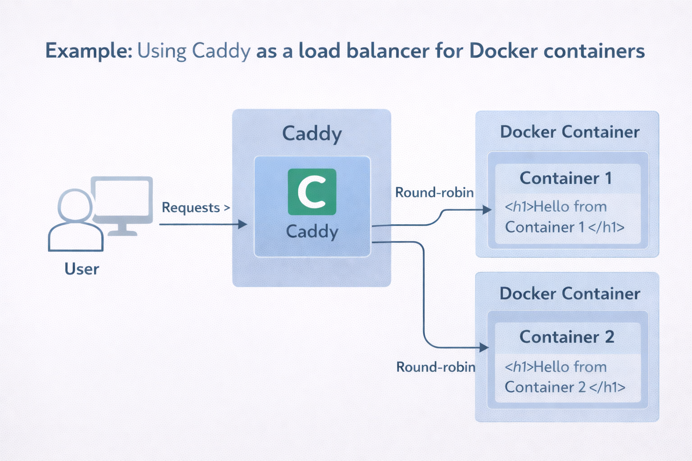

<h1>Table of Contents</h1>

<!-- TOC -->
- [What is Docker?](#what-is-docker)
- [Install Docker](#install-docker)
  - [Docker Desktop Installation Steps (Windows)](#docker-desktop-installation-steps-windows)
  - [Docker Hub](#docker-hub)
- [Docker Basics](#docker-basics)
  - [Images](#images)
    - [Pull a docker image](#pull-a-docker-image)
  - [Containers](#containers)
    - [Run a Container](#run-a-container)
      - [Note on ports](#note-on-ports)
    - [Run multiple containers](#run-multiple-containers)
    - [Stop a container](#stop-a-container)
- [Volume](#volume)
    - [Delete a volume](#delete-a-volume)
- [Execute (container CLI)](#execute-container-cli)
- [Container Networks](#container-networks)
    - [List existing networks](#list-existing-networks)
    - [Create a new network](#create-a-new-network)
    - [Inspect a network](#inspect-a-network)
    - [Attach a container to a network when running it](#attach-a-container-to-a-network-when-running-it)
    - [Connect an already running container to a network](#connect-an-already-running-container-to-a-network)
    - [Disconnect a container from a network](#disconnect-a-container-from-a-network)
    - [Delete a network](#delete-a-network)
  - [Types of Networks](#types-of-networks)
    - [Bridge](#bridge)
    - [MACVLAN](#macvlan)
    - [IPVLAN](#ipvlan)
    - [Overlay (multi-host)](#overlay-multi-host)
  - [Load Balancers](#load-balancers)
    - [Example: Using Caddy as a load balancer](#example-using-caddy-as-a-load-balancer)
  - [Offline mode](#offline-mode)
  - [netstat](#netstat)
- [Dockerfiles](#dockerfiles)
  - [Create a Dockerfile](#create-a-dockerfile)
  - [Build an Image from a Dockerfile](#build-an-image-from-a-dockerfile)
  - [Example 1: Dockerizing a Go server](#example-1-dockerizing-a-go-server)
    - [Build the server](#build-the-server)
    - [Create an image from a Dockerfile](#create-an-image-from-a-dockerfile)
    - [Ship an environment](#ship-an-environment)
  - [Example 2: Dockerizing a Python app](#example-2-dockerizing-a-python-app)
    - [Create the app](#create-the-app)
    - [Dockerize the app](#dockerize-the-app)
      - [First attempt (returns an error)](#first-attempt-returns-an-error)
      - [Second attempt (install interpreter)](#second-attempt-install-interpreter)
    - [Using an official Python image](#using-an-official-python-image)
- [Docker Compose](#docker-compose)
  - [compose.yaml](#composeyaml)
  - [Example: Orchestrating a Python App with Multiple Containers](#example-orchestrating-a-python-app-with-multiple-containers)
    - [1. Build/Get the app](#1-buildget-the-app)
    - [2. Define the Compose file](#2-define-the-compose-file)
    - [3. Deploy the multi-container app](#3-deploy-the-multi-container-app)
    - [4. Stop and remove the app](#4-stop-and-remove-the-app)
- [Debug](#debug)
  - [Docker logs](#docker-logs)
    - [View all logs](#view-all-logs)
    - [Follow logs in real-time](#follow-logs-in-real-time)
    - [Show only the last N lines](#show-only-the-last-n-lines)
    - [Include timestamps](#include-timestamps)
  - [Stats (resource utilization per container)](#stats-resource-utilization-per-container)
  - [Top (resource utilization per process)](#top-resource-utilization-per-process)
  - [Resource limits](#resource-limits)
- [Publish](#publish)
  - [Pushing to Docker Hub](#pushing-to-docker-hub)
  - [Pull your image](#pull-your-image)
  - [Tags](#tags)
    - [Latest](#latest)
- [Docker in the Software Development Lifecycle](#docker-in-the-software-development-lifecycle)
  - [The Deployment Process](#the-deployment-process)

<!-- /TOC -->


# What is Docker?

Docker allows us to deploy our applications inside [containers](https://www.boot.dev/lessons/356ec46f-df56-4cda-8860-d95cd72e3260), which are kind of like very lightweight virtual machines. Containers **share the host OS kernel**, so they don’t include a full OS — only a minimal OS layer with the userland libraries and tools your app needs. This lets us ship not just the application, but also the environment it runs in, making the app reproducible and **OS-independent**.

Containers can be run on almost any cloud service or on an orchestration platform like Kubernetes. If your app is written in a language like Python or JavaScript, Docker can package everything it needs — the interpreter and dependencies — so you don’t have to configure the server manually.

---
# Install Docker

Parts to keep in mind when it comes to using Docker locally:
1. The <strong>"Docker server"</strong> or <strong>"Docker Daemon"</strong>. This listens to requests from the desktop app and executes them. If this isn't running nothing else will work.
2. The <strong>"Docker Desktop"</strong> GUI. Starting the GUI should start the server, at least that's how I usually ensure the server is running. The GUI is the visual way to interact with Docker.
3. The <strong>Docker CLI</strong>. As a developer, most of your work will be interacting with Docker via the CLI. I'd recommend using the GUI to visualize what's going on with Docker, but executing most of your commands through the command line.

## Docker Desktop Installation Steps (Windows)

1. Enable WSL 2 
2. Download [Docker Desktop Installer](https://docs.docker.com/desktop/setup/install/windows-install/)
3. Run the installer and choose the backend (WSL vs Hyper-V) when prompted (WSL 2 recommended)
4. Confirm installation by running `docker version` in your CLI

Running Docker Desktop should start the server, indicated by the whale icon in the bottom-left corner of the GUI and the green 'Engine running' message.

## Docker Hub

[Docker Hub](https://hub.docker.com/) is the official cloud service for storing and sharing [Docker images](https://www.boot.dev/lessons/02b6052a-4005-4541-8ab1-3f5dbd6bcfbe), which serve as blueprints for building containers. In simple terms, Docker Hub lets you easily share and use prebuilt software packages, ensures consistent setups across teams, and accelerates deployment and collaboration.

To use Docker Hub:

1. [Create a free account](https://www.docker.com/products/docker-hub/)
2. Open up your Docker Desktop app and click "Sign in"
3. If unsure, confirm by running `docker login` in your CLI

Several popular <strong>alternatives to Docker Hub</strong> exist, often integrated with cloud service providers. For example,
- AWS ECR
- GCP Artifact Registry
- Azure Container Registry

The features are very similar between providers. Users can choose whatever's most convenient and cost effective.

---
# Docker Basics

## Images

Images are used to define containers. We can `pull`/download existing images from Docker Hub or `push`/share our own.

### Pull a docker image

1. <strong>Search</strong> for the software/image you need, either on Docker Hub or via the command `docker search <namespace/name>` 
2. <strong>Optional:</strong> Decide what version/tag you want (available only via Docker Hub)
3. <strong>Run</strong> the pull command: `docker pull <namespace/name>:<tag>`
    - `<namespace/name>` → the name of the image (e.g., python, nginx)
    - `<tag>` → optional, specifies the version (default is latest)

Saved images will be displayed under the "images" tab in Docker Desktop app or via the command `docker images`.

## Containers

Just like classes and objects in OOP, containers are instances of images - in other words, images brought to life. 

### Run a Container

Once an image is pulled or built, we can run it as a container. The `docker run` command starts a new container from an image.

`docker run -d -p <hostport>:<containerport> <namespace/name>:<tag>`

- `-d`: Run in detached mode (doesn't block your terminal)
- `-p`: Publish a container's port to the host (forwarding)
- `hostport`: The port on your local machine
- `containerport`: The port inside the container
- `namespace/name`: The name of the image (usually in the format username/repo)
- `tag`: The version of the image (often `latest`)

Running containers appear in the "Containers" tab of Docker Desktop or via the command `docker ps`. To see both running and stopped containers, use: `docker ps -a`.

#### Note on ports

Ports are like doors on a computer, allowing data to come in or go out. Since a container acts like a mini computer inside our machine, it has its own ports. Ports provide a way for the host and container to communicate. For `hostport`, the `docker run` command lets us choose any free port on our machine to access the container. For `containerport`, we must know in advance which port the service inside the container is listening on — for example, a web server typically listens on port 80, while a database like PostgreSQL listens on port 5432. You may then ask, "what if I am running multiple services within my container?", but the general docker philosophy is "one container for each service".

* Check if a port is free on your local machine with `nc -zv localhost <port>`; it is free if it shows “Connection refused”
* See which ports a Docker container listens on with `docker inspect <namespace/name> | grep ExposedPorts -A 5`

### Run multiple containers

Remember, Docker containers are lightweight and operate in their own isolated environments. It's normal to run many containers on a single host machine.

The procedure for running multiple containers is the same as for a single container, except that each container must use a unique localhost port. The container port can be the same if the containers run the same service, or different if they run different services.

**Same service example:** Running two web servers in separate containers

    docker run -p 8080:80 web-server-image
    docker run -p 8081:80 web-server-image

    Both containers use port 80 internally, but different host ports (8080 and 8081) to avoid conflicts.

**Different service example:** Running a web server and an API server

    docker run -p 8080:80 web-server-image
    docker run -p 9090:443 api-server-image

    Containers use different internal and host ports because they run different services.

### Stop a container

We stop a container when the service is no longer needed, when we need to update it — such as applying new environment variables, port mappings, or a new image version — or when we want to restart it cleanly to clear temporary state, cache, or recover from errors. Stopping is also useful for maintenance or troubleshooting, like checking logs, attaching a shell, or modifying configurations, and to save resources or costs, especially in production or cloud environments where idle containers still consume resources.

* `docker stop` sends a **SIGTERM** signal to the container’s main process, allowing it to exit gracefully and perform cleanup before stopping (recommended)
* `docker kill` sends a **SIGKILL** signal directly to the main process, immediately terminating it without cleanup (use as a last resort)

The general syntax is `docker stop <CONTAINER-ID>`, where `<CONTAINER-ID>` is the ID of the running container we want to stop; this can be found using `docker ps` or in Docker Desktop. The command also works with container names: `docker stop <CONTAINER-NAME>`.

    Note: Stopping a container does not delete it — it simply pauses the container. To delete a stopped container, use docker rm <CONTAINER-ID>. To delete a running container (not recommended), use docker rm -f <CONTAINER-ID>. To start a stopped container, use docker start <CONTAINER-ID>.

---
# Volume

Remember how on the PlayStation 1 all game progress was lost when you switched off the console unless you had a memory card? Containers behave similarly: if you stop a container, it keeps its progress (like pausing a game), but if you remove the container, all progress not saved to a volume is lost (like turning off the console without a memory card). 

[Volumes](https://docs.docker.com/engine/storage/volumes/) act like memory cards for containers. They let you save changes outside the container so your data persists even if the container is removed. Furthermore, just like the same memory card can be used on different consoles, the same volume can be mounted to multiple containers to share data. A volume (1) saves container data outside the container, (2) can be mounted to multiple containers to share data, and (3) keeps container images lightweight since data isn’t baked into the image.

To store a container's data in a volume, you mount the volume to the path inside the container where the service/app stores its data:
1. Create a new empty volume: `docker volume create <volume_name>`
    - (Noteworthy / optional) List available volumes: `docker volume ls`
    - (Noteworthy / optional) Get volume location: `docker volume inspect <volume_name>`
2. Run the container with the volume: 

    ```
    docker run -d \
    -p <hostport>:<containerport> \
    -v <volume_name>:<container_path> \
    <image_name>
    ```
    
    `-v <volume_name>:<container_path>` → A service stores its files at a specific path inside the container (official image documentation on Docker Hub lists these paths). Mounting a volume at this path ensures the data is persisted outside the container. 

### Delete a volume

1. List volumes: `docker volume ls`
2. Delete a volume: `docker volume rm <volume_name>`

If the volume is in use by a container, you’ll need to remove the container first.

---
# Execute (container CLI)

It is possible to run commands inside a running container. It’s similar to connecting to a remote server and executing commands there — the commands run inside the container, not on your own machine.

- Run a once-off Linux command: `docker exec <CONTAINER_ID> <linux_command>`<br>
- or start a shell session to run multiple commands: `docker exec -it <CONTAINER_ID> /bin/sh` 

You can run any Linux command that exists inside the container. Containers are isolated, so if a command or program isn’t installed in the container, it won’t work. For example, `/bin/sh` won’t work if the container image didn’t include it.

---

# Container Networks

Container networks are used to connect containers to each other and to the outside world. They are built on standard components provided by Docker, such as libnetwork. Every container is connected to a network by default, even if one is not explicitly specified. However, it is recommended to create your own networks rather than relying on the default. This allows Docker to provide internal name resolution, so containers can communicate using each other’s names instead of IP addresses. Additionally, custom networks help keep groups of containers isolated and better organized.

The Docker CLI provides commands to manage container networks. The main operations are:

1. Create networks  
2. Inspect networks  
3. Connect containers to networks  

### List existing networks

```bash
docker network ls
```

### Create a new network

```bash
docker network create -d <network_driver> <network_name>
```

* `-d` specifies the network driver.
* `<network_driver>` can be `bridge` (default), `overlay`, `macvlan`, etc.
* `<network_name>` is the name you assign to the network.

### Inspect a network

```bash
docker network inspect <network_id_or_name>
```

### Attach a container to a network when running it

```bash
docker container run -dit --name <container_name> --network <network_id_or_name> <image_name>
```

### Connect an already running container to a network

```bash
docker network connect <network_id_or_name> <container_id_or_name>
```

### Disconnect a container from a network

```bash
docker network disconnect <network_id_or_name> <container_id_or_name>
```

### Delete a network

```bash
docker network rm <network_id_or_name>
```

## Types of Networks

- Bridge → containers live inside the host’s network. <br>
- Macvlan → containers live alongside the host, host can’t talk to them directly. <br>
- Ipvlan → containers live alongside the host, but host can talk to them, and network traffic is more lightweight.

### Bridge

Bridge networks help isolate containers while controlling which services are exposed externally. They keep containers hidden from the host while allowing them to communicate with each other: 
- Containers live on a private network inside the host.
- They can communicate with each other using IP addresses or container names.
- By default, containers are hidden from the outside world. To allow access from the host, a browser, or other machines, you need to publish a port.

`docker network create -d bridge <network_name>`

### MACVLAN 

With macvlan, Docker tells the network: “Pretend each container is a completely different machine.” A macvlan network connects containers directly to the physical network. In this setup, containers are independent from the host’s network path:
- Containers appear as separate devices on the local network.
- Containers communicate with other devices and the internet directly, without going through the host.
- By default, the host and containers cannot communicate directly with each other, though they can still reach each other indirectly via the network.

**Con**: Needs a network card in premiscuous mode which normally is not allowed on public cloud networks.

`docker network create -d macvlan <network_name>`

### IPVLAN

With ipvlan, Docker connects containers directly to the physical network, similar to macvlan, but with a key difference in how traffic is handled:
- Containers appear as separate devices on the local network, just like with macvlan.
- Containers can communicate with other devices and the internet directly, without going through the host.
- Unlike macvlan, the host can communicate with containers on the same network if configured correctly.
- Ipvlan is often more efficient than macvlan because it handles traffic at a lower network layer, reducing overhead.

**Pro**: Unlike macvlan, IPVLAN assigns containers only IP addresses — not separate MAC addresses — so promiscuous mode is not required.  

`docker network create -d ipvlan <network_name>`

### Overlay (multi-host)

Single-host networks like bridge, macvlan, and ipvlan operate within a single Docker host and do not span multiple machines. Multi-host overlay networks, on the other hand, allow containerized applications to run across multiple Docker hosts (that is, multiple machines running the Docker Engine). 

An overlay network creates a single, shared network where containers can communicate freely with each other, so there is no need to map ports between containers for inter-container access. When required, overlay network traffic can be encrypted.

**Prerequisite**: the hosts must be part of a Docker Swarm or another cluster (such as Kubernetes) that manages multi-host networking.

## Load Balancers

A popular application usually runs on multiple servers. This improves scalability, allowing it to handle more traffic; reliability, so if one server fails, others continue serving; and performance, by sharing the workload across servers. This is handled by a [load balancer](https://www.boot.dev/lessons/d593f864-8c96-4ba4-988c-d86f27063919), which manages workload by balancing network traffic across available servers. Some balancers evenly distribute workload, while others consider resource utilization (CPU and memory) before deciding where to route traffic. The goal is to “balance the load” so that no single backend server becomes overwhelmed.

Similarly, docker lets you spin up multiple identical containers of the same application, and configure a load balancer to route incoming requests to available containers.

| Feature              | Without Load Balancer                        | With Load Balancer                                 |
| -------------------- | -------------------------------------------- | -------------------------------------------------- |
| User access          | Must use specific container ports            | Single port (e.g., 8080) for all users             |
| Traffic distribution | Hits only the container the user connects to | Distributed to all containers                      |
| Fault tolerance      | If a container fails, user loses access      | Requests automatically go to healthy containers    |
| Scaling              | Manual: assign new ports, update URLs        | Easy: add containers, update load balancer         |
| Management overhead  | High: must track containers and ports        | Low: handles routing automatically                 |
| User experience      | Confusing: different URLs per container      | Simple: one URL, seamless routing                  |

Both [Docker Swarm](https://www.geeksforgeeks.org/devops/introduction-to-docker-swarm-mode/) and [Kubernetes](https://www.geeksforgeeks.org/devops/introduction-to-kubernetes-k8s/) have built-in load balancing but there are also other tools like [Caddy](https://caddyserver.com/), [Nginx](https://www.f5.com/products/nginx) and [Apache](https://httpd.apache.org/).

---

### Example: Using Caddy as a load balancer

One simple strategy that load balancers use is the "round robin" where requests are simply routed one after the other to different back-end servers.



Run multiple containers of the same app and use Caddy to distribute traffic between them:

1. Pull the official caddy image from DockerHub: `docker pull caddy`

2. Create two simple web pages and save the files in your current working directory

    ```bash
    # Create index1.html
    echo "<h1>Hello from Container 1</h1>" > index1.html
    ```

    ```bash
    # Create index2.html
    echo "<h1>Hello from Container 2</h1>" > index2.html
    ```

3. Create a new network
    ```bash
    # This allows the containers to communicate using their names
    docker network create lb-net
    ```
 
4. Start two backend containers (read the [docs](https://hub.docker.com/_/caddy/))

    ```bash
    # Container 1
    docker run -d --name app1 --network lb-net -v $(pwd)/index1.html:/usr/share/caddy/index.html caddy

    # Container 2
    docker run -d --name app2 --network lb-net -v $(pwd)/index2.html:/usr/share/caddy/index.html caddy
    ```
    Each container serves its HTML file on port 80 internally. We don’t need host ports because the load balancer will route traffic.

5. Configure Caddy as a load balancer

    Create a [Caddyfile](https://caddyserver.com/docs/caddyfile) (no extension) in your local directory: 
    ```bash
    # This tells Caddy to listen on localhost:8080 and round-robin incoming traffic
    # to app1:80 and app2:80. This works because the load balancer runs on the same
    # Docker network, so app1 and app2 resolve to the application containers.

    cat > Caddyfile <<EOF
    localhost:8080

    reverse_proxy app1:80 app2:80 {
        lb_policy round_robin
    }
    EOF
    ```

6. Run the Caddy load balancer on the same network

    ```bash
    # On Windows PowerShell, replace $(pwd) with ${PWD}
    # Inside the container → Caddy listens on port 8080
    # Outside the container (host machine) → traffic to localhost:8080 is forwarded into the container’s 8080
    # Using the same port on both sides is common and keeps things simple
    docker run -d --name load_balancer --network lb-net -p 8080:8080 -v $(pwd)/Caddyfile:/etc/caddy/Caddyfile caddy
    ```

7. Test the load balancer

    Open a browser and go to http://localhost:8080
    
    - Refresh multiple times.
    - Responses should alternate between Container 1 and Container 2, demonstrating round-robin load balancing.

## Offline mode

Forcing a container into offline mode is usually for security reasons. You might want to remove the network connection from a container in one of these scenarios:

- You're running 3rd party code that you don't trust, and it shouldn't need network access
- You're building an e-learning site, and you're allowing students to execute code on your machines
- You know a container has a virus that's sending malicious requests over the internet, and you want to do an audit

The `docker run` command has a `--network none` flag that makes it so that the container can't network with the outside world: `docker run -d --network none <image_name>`

## netstat

`netstat` shows network connections, listening ports, and which programs use them. It is used for checking if a service is running, debugging port or connectivity issues, and verifying which ports a container is listening on.

`docker exec <CONTAINER_ID> netstat -ltnp`

---

# Dockerfiles 

Docker can be used in different ways. You can run software using other people’s images (for example, pulling from Docker Hub and running it as a container), or you can build images for your own software and servers.

Docker images are built from Dockerfiles — text files that define how an image is assembled. A Dockerfile is effectively ["Infrastructure as Code"](https://en.wikipedia.org/wiki/Infrastructure_as_code) (IaC) for an image - it contains the instructions for how it should be built. Instead of manually installing or updating software on servers, we update the Dockerfile, commit it to source control, and rebuild the image automatically.

## Create a Dockerfile

For VS Code, the [Docker Extension](https://marketplace.visualstudio.com/items?itemName=ms-azuretools.vscode-docker) is recommended for some some nice syntax highlighting.

```bash
# Create Dockerfile (usually at the root of your project dir) and open in VS code
touch Dockerfile && code Dockerfile
```

A Dockerfile takes a set of commands, some of which are shown below:

```Dockerfile
# 1. Base image (required)
FROM <base-image:tag>

# 2. Optional metadata
LABEL maintainer="<your-email>"

# 3. Set working directory (recommended but not strictly required)
WORKDIR <working-directory-path>

# 4. Copy project files into the image (optional but common)
COPY <src> ... <dest>

# 5. Install dependencies (optional, depends on your app)
RUN <install-dependencies-command>

# 6. Expose a port (optional, mostly documentation)
EXPOSE <port-number>

# 7. Default command to run your app (recommended)
CMD ["<executable>", "<arg1>", "<arg2>", "..."]
```

**Explanation of each command:**

1. `FROM <base-image:tag>` (Required)

    Sets the starting point for your image. Everything else builds on top of this base. Without a `FROM`, the Dockerfile won’t know what environment to use.

2. `LABEL maintainer="<your-email>"` (Optional)
    
    Adds metadata to the image, like who maintains it. Useful for documentation and tracking purposes.

3. `WORKDIR <working-directory-path>` (Recommended)

    Sets the working directory inside the image.
    Relative paths used by `RUN`, `CMD`, and the destination of `COPY` are resolved from this directory.
    If `WORKDIR` is not set, the default directory is `/` (root).

4. `COPY <src> ... <dest>` (Optional but common)

    Copies files from your project into the image’s working directory so the container has all the code it needs.

5. `RUN <install-dependencies-command>` (Optional, depends on your app)

    Installs software, libraries, or packages your app needs to run. For example, `pip install -r requirements.txt` for Python.

6. `EXPOSE <port-number>` (Optional)
    
    Its main purpose is to inform humans and tooling about which port the app is expected to use. It does not publish the port or make it accessible on the host by itself. `EXPOSE` does have a small effect in Docker’s internal networking: it marks the port in the image metadata, and tools like `docker inspect` or DockerHub can see it. But for running containers with `docker run`, it does nothing functionally.

7. `CMD ["<executable>", "<arg1>", "<arg2>", "..."]` (Recommended)
    
    Specifies the command to run when the container starts, such as starting your application. Only one `CMD` is used per container, and it can be overridden at runtime.

## Build an Image from a Dockerfile

```bash
# Build from a Dockerfile in the build context
docker build -t <image-name>:<tag> <path-to-build-context>
```
- `-t <image-name>:<tag>` → gives your image a name and an optional tag (default is `latest`)
- `<path-to-build-context>` → a directory including the files Docker can copy into the image
- Docker automatically looks for a file named `Dockerfile` in the root of the build context

```bash
# Build from a Dockerfile with a custom name or location
docker build -t <image-name>:<tag> -f <path-to-Dockerfile> <path-to-build-context>
```
- `-f <path-to-Dockerfile>` → points to the Dockerfile if it’s not named "Dockerfile" or not in the build context root
- `<path-to-build-context>` → still required; defines the files Docker can access during the build

## Example 1: Dockerizing a Go server

A server is needed when something must be accessible over a network, not just locally. Containerizing a server is just a specific case of containerizing an app:
- Containerizing an app = packaging code + runtime + dependencies
- If that app listens for requests, it’s a server
- Same process, same tools, same reasons

The steps for dockerizing a Go server are simple:

1. Build the Server
2. Create a Dockerfile
3. Build an image using the Dockerfile (which will copy in the built server)
4. Run the image in a container

### Build the server

```bash
# 1️⃣ Create the project folder and open main.go in VS Code
mkdir goserver
touch goserver/main.go && code goserver/main.go
```

```go
// 2️⃣ Paste this inside main.go
package main

import (
	"fmt"
	"log"
	"net/http"
	"time"
)

func main() {
	m := http.NewServeMux()

	m.HandleFunc("/", handlePage)

	const port = "8010"
	srv := http.Server{
		Handler:      m,
		Addr:         ":" + port,
		WriteTimeout: 30 * time.Second,
		ReadTimeout:  30 * time.Second,
	}

	// this blocks forever, until the server
	// has an unrecoverable error
	fmt.Println("server started on ", port)
	err := srv.ListenAndServe()
	log.Fatal(err)
}

func handlePage(w http.ResponseWriter, r *http.Request) {
	w.Header().Set("Content-Type", "text/html")
	w.WriteHeader(200)
	const page = `<html>
<head></head>
<body>
	<p> Hello from Docker! I'm a Go server. </p>
</body>
</html>
`
	w.Write([]byte(page))
}
```

```bash
# 3️⃣ Initialize the module, build, and run the server
cd goserver

# Initialize a Go module (replace with your own module path if needed)
go mod init github.com/ioakeim-h/goserver 

# Build the executable: by default it's name is the same as your project's directory
go build

# Run the executable (stop with Ctrl+C)
./goserver 

# Optionally, open your browser and visit:
# http://localhost:8010
```

### Create an image from a Dockerfile

Create a Dockerfile in the root of your server's repo:
```bash
touch Dockerfile && code Dockerfile
```

The Dockerfile should, at a minimum, contain an OS layer (`FROM`), copy the compiled Go server into the image (`COPY`), and specify a command to run the server (`CMD`). A `RUN` command is not required since Go has no external dependencies! 

```Dockerfile
# A simple lightweight Debian Linux OS
FROM debian:stable-slim

# Copy goserver to /bin/goserver
COPY goserver /bin/goserver

# Default command to run when the container starts.
# If no command is provided to `docker run`, this binary will execute automatically.
CMD ["/bin/goserver"]
```

Build the image and run as a container:
```bash
# This says: docker build – from the build context – an image called goserver with the tag latest
docker build . -t goserver:latest

# View output at http://localhost:8010
docker run -d -p 8010:8010 goserver
```

### Ship an environment

Up to this point, the Go server sets the port to a hard-coded value of 8010, as seen in `main.go`. We can go a step further and have it read an environment variable called `PORT`. Then, by specifying an [ENV](https://docs.docker.com/reference/dockerfile#env) command in our Dockerfile, we can tell the app which port to listen on. This way, the app is shipped along with the environment it depends on. 

First, we're going to make the port that our server binds to configurable: it will be set by an environment variable.

```go
package main

import (
	"fmt"
	"log"
	"net/http"
	"os" // import os package
	"time"
)

func main() {
	m := http.NewServeMux()

	m.HandleFunc("/", handlePage)

	port := os.Getenv("PORT") // this reads an ENV variable: PORT
	srv := http.Server{
		Handler:      m,
		Addr:         ":" + port,
		WriteTimeout: 30 * time.Second,
		ReadTimeout:  30 * time.Second,
	}

	fmt.Println("server started on ", port)
	err := srv.ListenAndServe()
	log.Fatal(err)
}

func handlePage(w http.ResponseWriter, r *http.Request) {
	w.Header().Set("Content-Type", "text/html")
	w.WriteHeader(200)
	const page = `<html>
<head></head>
<body>
	<p> Hello from Docker! I'm a Go server. </p>
</body>
</html>
`
	w.Write([]byte(page))
}
```

Second, rebuild your Go program:
```bash
go build
```

Third, add an `ENV` command to your Dockerfile to set the port within the image. You'll need to do it before the `CMD` command so that the environment variable is set before the server starts.

```Dockerfile
FROM debian:stable-slim

COPY goserver /bin/goserver

ENV PORT=8991

CMD ["/bin/goserver"]
```

Fourth, rebuild your Docker image
```bash
docker build . -t goserver:latest
```

Finally, rerun your Docker container, be sure to expose the correct port:
```bash
docker run -d -p 8991:8991 goserver
```

## Example 2: Dockerizing a Python app

We've seen how simple it is to dockerize Go programs! The machine (or Docker image) running the program doesn't need the Go compiler installed. None of the following languages are easily deployed in the same way: Python, JavaScript/TypeScript, Java, Ruby, PHP, C#, etc. They all require their respective runtimes to be installed. For example, Python needs the Python interpreter. Let's Dockerize a Python script to demonstrate.

### Create the app

1. Copy the Python code and add it to a new `main.py` file in your project directory

    ```python
    def main():
        book_path = "books/frankenstein.txt"
        text = get_book_text(book_path)
        num_words = get_num_words(text)
        chars_dict = get_chars_dict(text)
        chars_sorted_list = chars_dict_to_sorted_list(chars_dict)

        print(f"--- Begin report of {book_path} ---")
        print(f"{num_words} words found in the document")
        print()

        for item in chars_sorted_list:
            if not item["char"].isalpha():
                continue
            print(f"The '{item['char']}' character was found {item['num']} times")

        print("--- End report ---")


    def get_num_words(text):
        words = text.split()
        return len(words)


    def sort_on(d):
        return d["num"]


    def chars_dict_to_sorted_list(num_chars_dict):
        sorted_list = []
        for ch in num_chars_dict:
            sorted_list.append({"char": ch, "num": num_chars_dict[ch]})
        sorted_list.sort(reverse=True, key=sort_on)
        return sorted_list


    def get_chars_dict(text):
        chars = {}
        for c in text:
            lowered = c.lower()
            if lowered in chars:
                chars[lowered] += 1
            else:
                chars[lowered] = 1
        return chars


    def get_book_text(path):
        with open(path) as f:
            return f.read()


    main()
    ```

2. [Copy the Frankenstein book's text from here](https://raw.githubusercontent.com/asweigart/codebreaker/master/frankenstein.txt) and save it to a file in books/frankenstein.txt in your project directory.
3. Make sure you have Python 3.10+ installed. You can check with `python --version` or `python3 --version`. If not, install the newest version of python:
    ```bash
    # Linux (or WSL)
    sudo apt update
    sudo apt install -y python3

    # Mac OS
    brew install python
    ```

3. Make sure the program works. You should get a nice little report in your console describing some stats about the characters and words found in the book: `python3 main.py`

### Dockerize the app

#### First attempt (returns an error)

1. Create a Dockerfile called `Dockerfile.py`

    ```Dockerfile
    FROM debian:stable-slim
    COPY main.py main.py
    COPY books/ books/
    CMD ["python", "main.py"]
    ```

    Notice that we're moving the Python code (because it's not a compiled program) as well as the data files into the image.

2. Build the image, be sure to specify the Dockerfile name because we're not using the default `"Dockerfile"` name:
    ```bash
    docker build -t bookbot -f Dockerfile.py .
    ```

You should get an error here. The problem is *our image doesn't have the python interpreter installed*, so it can't run the script.

#### Second attempt (install interpreter)

1. Update the `Dockerfile.py` to use `RUN` commands to install the necessary dependencies before the script is started.

    ```Dockerfile
    # Build from a slim Debian/Linux image
    FROM debian:stable-slim

    # Update apt
    RUN apt update
    RUN apt upgrade -y

    # Install build tooling
    RUN apt install -y build-essential zlib1g-dev libncurses5-dev libgdbm-dev libnss3-dev libssl-dev libreadline-dev libffi-dev libsqlite3-dev wget libbz2-dev

    # Download Python interpreter code and unpack it
    RUN wget https://www.python.org/ftp/python/3.10.8/Python-3.10.8.tgz
    RUN tar -xf Python-3.10.*.tgz

    # Build the Python interpreter
    RUN cd Python-3.10.8 && ./configure --enable-optimizations && make && make altinstall

    # Copy our code into the image
    COPY main.py main.py

    # Copy our data dependencies
    COPY books/ books/

    # Run our Python script
    CMD ["python3.10", "main.py"]
    ```

2. Rebuild the image 
    ```bash
    docker run bookbot
    ```

### Using an official Python image

Popular tools like Python have official images on DockerHub. Using an official image simplifies our Docker setup significantly.
Instead of building Python from scratch with multiple `RUN` commands, we can start from the official image as shown below:

```Dockerfile
# Gives you a lightweight Python runtime.
FROM python:3.12-slim

COPY main.py main.py
COPY books/ books/

# Match the Python version to the base image
CMD ["python3.12", "main.py"]
```

Furthermore, when using an official Python image, there’s no need to specify a separate OS layer. The image already includes a lightweight OS (usually Debian or Alpine), so you can start running Python programs immediately with `FROM python:3.x`.

---

# Docker Compose

Docker Compose is a tool for defining and running multi-container Docker applications. It lets you manage multiple containers as a single application using a declarative configuration file. While it shares the idea of orchestration with Docker Swarm and Kubernetes, it is not a full orchestration platform—it is designed mainly for local development, testing, and small deployments, and is significantly simpler to use.

- Compose is mainly for local multi-container setups.
- Swarm is Docker’s built-in production orchestration (easy to switch from Compose).
- Kubernetes is for full-scale, enterprise-grade orchestration.

## compose.yaml

Compose (or YAML) files define multi-container apps. When you need to run an app that requires more that one containers, instead of running each container separately with long `docker run` commands and figuring out how to connect them, a Compose file lets you describe all of them together in one place.
- Define all services your app needs (web, database, cache, etc.).
- Set how they run (ports, environment variables, volumes).
- Start everything with one command: `docker compose up`.
- Stop everything easily: `docker compose stop`.
- Stop **and remove** containers and networks: `docker compose down`

Docker Compose makes it easy to share and reproduce your app on any machine. Here’s how a `compose.yaml` file may look:

```yaml
networks:
  <network_name>:

volumes:
  <volume_name>:

services:
  <service1_name>:
    build: <path_to_dockerfile_or_dot>
    command: <start_command>
    ports:
      - target: <container_port>
        published: <host_port>
    networks:
      - <network_name>
    volumes:
      - type: volume
        source: <volume_name>
        target: <container_path>

  <service2_name>:
    image: <image_name>:<tag>
    networks:
      - <network_name>
```

## Example: Orchestrating a Python App with Multiple Containers

### 1. Build/Get the app
```bash
# Clone the app repository
 git clone https://github.com/nigelpoulton/ddd2023.git myAppFiles

 # Move to the Compose files directory
 cd myAppFiles/compose
 ```

The cloned directory contains a Python Redis app, its dependencies (`requirements.txt`), a `Dockerfile` describing how to build an image for the app, a `README.md`, and a `compose.yaml` file. 

### 2. Define the Compose file

Assuming we already have everything needed — including a Dockerfile and any other files the app depends on — we can define the Compose file. In our example, both the Dockerfile and the `compose.yaml` file are already included in the cloned repo. We can view its contents with: `cat compose.yaml`

```yaml
networks:
  counter-net: # defines a Docker network named 'counter-net'

volumes:
  counter-vol: # defines a Docker volume named 'counter-vol'

services:
  web-fe: # defines a container/service named 'web-fe'
    build: . # builds the image using the Dockerfile in the current directory
    command: python app.py # runs the Python app
    ports:
      - target: 8080 # container port the app listens on
        published: 5001 # maps container port 8080 to host port 5001
    networks:
      - counter-net # connects the container to 'counter-net'
    volumes:
      - type: volume
        source: counter-vol # mounts the 'counter-vol' volume
        target: /app # anything written inside the container at /app will be saved

  redis: # defines a second container/service named 'redis'
    image: "redis:alpine" # uses the official 'redis:alpine' image
    networks:
      - counter-net # connects the container to 'counter-net'
```

### 3. Deploy the multi-container app
To start the application and create all images, networks, and volumes defined in the `compose.yaml` file, use:
```bash
# View the app at: http://localhost:5001/
docker compose up -d
```
* The `-d` flag runs the containers in detached mode, freeing the terminal while keeping the containers running in the background even after the terminal is closed.

By default, this tells Docker to look for a config file **in the local directory** called `compose.yaml`. However, we can specify a different file — either with a different name or located outside the local directory — by using the `-f` flag, just like we do for Dockerfiles.

We can inspect running containers with `docker compose ps`, list volumes with `docker volume ls`, list networks with `docker network ls`, and list images with `docker images`. Anything created with `docker compose` — unless it’s an official image that the Compose file instructs Docker to pull (e.g., `redis:alpine`) — will receive a prefix based on the parent directory name. For example, since the parent directory of our project is called `compose`, the volume defined in the Compose file will be named `compose_counter-vol`.

### 4. Stop and remove the app

We can bring the app down with `docker compose down` — this tells Docker to read the `compose.yaml` file in the local directory to know what to stop and remove (we can also use the `-f` flag if needed):
- Gracefully stops the app
- Saves the state in the defined volume 
- Removes the containers and the defined network

Notice that the Redis app did not use a volume, so if you refreshed the page as the instructions asked, restarting the app will not change the counter.

Note: A regular `docker compose down` does not remove volumes or images. To remove them, use: `docker compose down -v --rmi all`

---

# Debug

## Docker logs

When containers are running in detached mode with the `-d` flag, you don't see any output in your terminal, which is nice for keeping your terminal clean, but what if something goes wrong? Enter the `docker logs` command. 

```bash
docker logs [OPTIONS] CONTAINER
# CONTAINER can be an id or name
```

`docker logs` is basically a window into your containerized application’s behavior. It lets you see:
- What your app is doing: startup messages, progress updates, requests being processed.
- Errors or exceptions: crashes, failed database connections, or unexpected behavior.
- Debugging info: anything you `print()` or log in your code.

It does not show system logs of the host—only what the container itself outputs.

### View all logs
```bash
# Shows all output (stdout & stderr) from the container since it started.
docker logs <container_name_or_id>
```

### Follow logs in real-time
```bash
# Continuously displays new logs as they appear. Press Ctrl+C to stop.
docker logs -f <container_name_or_id>
```

### Show only the last N lines
```bash
# Displays only the last 20 lines of logs (you can change the number as needed).
docker logs --tail 20 <container_name_or_id>
```

### Include timestamps
```bash
# Shows each log line with the time it was written.
docker logs -t <container_name_or_id>
```

## Stats (resource utilization per container)

What if we want to see a container's resource utilization? It's common to spin up some Docker containers, forget about them, and then wonder why your host machine has gotten really slow. It's really nice to see how much RAM/CPU each container is using, and it's critical in production environments.

The `docker stats` command gives you a live data stream of resource usage for running containers.
```bash
docker stats
```

## Top (resource utilization per process)

The `docker top` command shows the running processes inside a container.
```bash
# The "C" column refers to CPU usage.
docker top <container_name_or_id>
```

Note: Use `stats` for entire containers and `top` for processes in a container.

## Resource limits

Being able to monitor container resources is crucial for maintaining healthy container environments, especially in production settings. When you notice a container's using too many resources, if you don't have the time or the ability to "fix" the code, you can limit the resources the container has available. The `docker run` command has a few options for limiting resources:

`--memory`: Limit the memory available to the container
`--cpus`: Limit the CPU shares available to the container

Example usage: 

```bash
# Limit the CPUs to only 0.25 (1/4th of a CPU core)
docker run -d --cpus="0.25" --name cpu-stress alexeiled/stress-ng --cpu 2
```

This command runs a container using the [stress-ng](https://hub.docker.com/r/alexeiled/stress-ng), which is designed to intentionally generate high CPU and memory load. The `--cpu 2` argument belongs to stress-ng, not Docker, and instructs the application to start two CPU worker threads. On its own, this would result in heavy CPU usage. However, by setting `--cpus="0.25"`, Docker limits the container to 25% of a single CPU core. Even though the application attempts to consume more CPU, Docker enforces this restriction, preventing the container from impacting overall system performance.

---

# Publish

## Pushing to Docker Hub

[Docker Hub](https://hub.docker.com/) is the official cloud service for storing and sharing Docker images. We call these kinds of services "registries". Other popular image registries include:

- [AWS ECR](https://aws.amazon.com/ecr/)
- [GCP Artifact Registry](https://docs.cloud.google.com/artifact-registry/docs)
- [GitHub Container Registry](https://docs.github.com/en/packages/working-with-a-github-packages-registry/working-with-the-container-registry)
- [Harbor](https://goharbor.io/)
- [Azure ACR](https://azure.microsoft.com/en-au/products/container-registry/)

After building an image, we can publish it to Docker Hub. First, make sure you are signed in to Docker Hub — either via the Docker Desktop GUI or by running `docker login` in the CLI. Then, push the image to Docker Hub using `docker push`:
```bash
docker push <dockerhub-username>/<image-name>:<tag>
```
If everything worked, you should be able to refresh your [repositories page](https://hub.docker.com/repositories) and see your new image! **By default, Docker Hub makes your images public, so anyone can pull them.**

## Pull your image

```bash
# You must be logged in to Docker Hub
docker pull <dockerhub-username>/<image-name>:<tag>
```

## Tags

With Docker, a tag is a label that you can assign to a specific version of an image, similar to a tag in Git. The latest tag is the default tag that Docker uses when you don't specify one. It's a convention to use `latest` for the most recent version of an image, but it's also common to include other tags, often [semantic versioning](https://semver.org/) tags like `0.1.0`, `0.2.0`, etc.

Publishing new versions of Docker images is a very common method of deploying cloud-native back-end servers. Here's a diagram describing the deployment pipeline of many production systems: 


### Latest

As it turns out, the `latest` tag doesn't always indicate that a specific tag is the latest version of an image. In reality, `latest` is just the default tag that's used if you don't explicitly supply one. It is best to use [semantic versioning](https://semver.org/) on all your images, but to also push to the "latest" tag on your most recent image. That way you can keep all of your old versions around, but the latest tag still always points to the latest version.

```bash
docker build -t <dockerhub-username>/<image-name>:<semantic-version> -t <dockerhub-username>/<image-name>:latest <path-to-build-context>
docker push <dockerhub-username>/<image-name> --all-tags
```

So, for example, if I were updating an application to version 5.4.6, I would probably do it like this:
```bash
docker build -t ioakeimh/awesomeimage:5.4.6 -t ioakeimh/awesomeimage:latest .
docker push ioakeimh/awesomeimage --all-tags
```

The first command applies two tags to the same image
- `ioakeimh/awesomeimagee:5.4.6` → fixed version
- `ioakeimh/awesomeimage:latest` → “most recent” pointer

The second command pushes every tag of `ioakeimh/awesomeimage` to the remote registry
- `ioakeimh/awesomeimage:5.4.6`
- `ioakeimh/awesomeimage:latest`

This way, pushing a new image with the same latest tag overwrites the previous latest on the registry but leaves all the semantic version tags intact.

---

# Docker in the Software Development Lifecycle

## The Deployment Process

1. The developer (you) writes some new code
2. The developer commits the code to Git
3. The developer pushes a new branch to GitHub
4. The developer opens a [pull request](https://docs.github.com/en/pull-requests/collaborating-with-pull-requests/proposing-changes-to-your-work-with-pull-requests/about-pull-requests) to the `main` branch
5. A teammate reviews the PR and approves it (if it looks good)
6. The developer merges the pull request
7. Upon merging, an automated script, perhaps a [GitHub action](https://docs.github.com/en/actions), is started
8. The script builds the code (if it's a compiled language)
9. The script builds a new docker image with the latest program
10. The script pushes the new image to Docker Hub
11. The server that runs the containers, perhaps a [Kubernetes](https://kubernetes.io/) cluster, is told there is a new version
12. The k8s cluster pulls down the latest image
13. The k8s cluster shuts down old containers as it spins up new containers of the latest image

While the deployment process outlined above is a common one, especially at newer "cloud native" companies, two companies rarely have identical processes. Instead of GitHub, it might be GitLab. Instead of Docker Hub, it might be ECR. Instead of Kubernetes, it might be Docker Swarm or a more managed service.