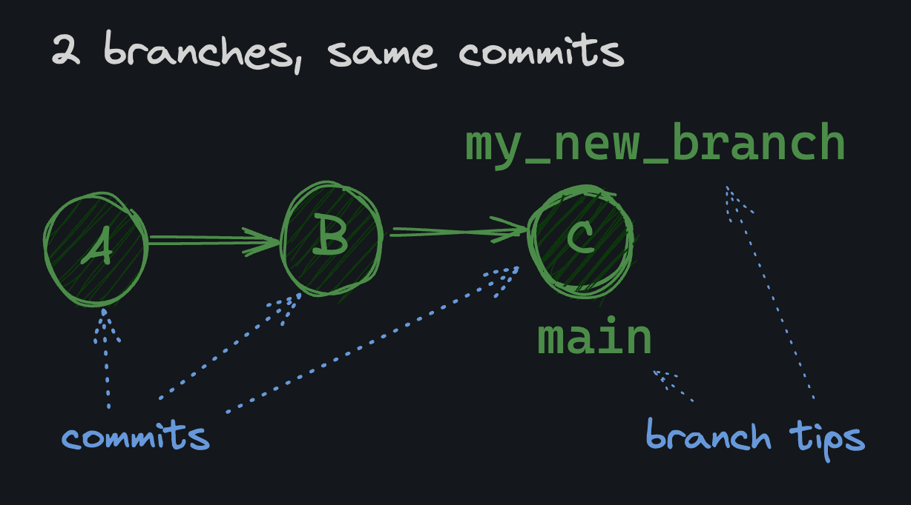

# Config

Git comes with a [configuration](https://git-scm.com/docs/git-config) both at the global and the local (repo) level. The configuration requires a name and an email. To check if these are already set:
```bash
git config --get user.name
git config --get user.email
```

Configure git:
```bash
git config --add --global user.name "github_username_here"
git config --add --global user.email "email@example.com"
```

* `git config`: The command to interact with your Git configuration.
* `--add`: Flag stating you want to add a configuration.
* `--global`: Flag stating you want this configuration to be stored globally in your `~/.gitconfig`. The opposite is "local", which stores the configuration in the current repository only.
* `user`: The section.
* `name`: The key within the section.
* `"github_username_here"`: The value you want to set for the key.

Display all config settings:
```bash
git config --list
```

Remove a config setting:
```bash
git config --unset <section.key>
```

## Locations

There are several locations where Git can be configured. From more general to more specific, they are:

* **system**: `/etc/gitconfig`, a file that configures Git for all users on the system
* **global**: `~/.gitconfig`, a file that configures Git for all projects of a user
* **local**: `.git/config`, a file that configures Git for a specific project
* **worktree**: `.git/config.worktree`, a file that configures Git for part of a project

In my experience, 90% of the time you will be using `--global` to set things like your username and email. The other 9% of the time you will be using `--local` to set project-specific configurations. The last 1% of the time you might need to futz with system and worktree configurations, but it's extremely rare.

### Overriding 

If you set a configuration in a more specific location, it will override the same configuration in a more general location. For example, if you set `user.name` in the local configuration, it will override the `user.name` set in the global configuration.


---

# Git Repo

The very first step of any project is to create a repository. A Git "repository" (or "repo") represents a single project. 

A repo is essentially just a directory that contains a project (other directories and files). The only difference is that it also contains a hidden `.git` directory. That hidden directory is where Git stores all of its internal tracking and versioning information for the project.

To run `git` commands, we must first be in a Git repository. 
Create a new, empty Git repository in the current directory:
```bash
git init
```

## Status

A file can be in one of [several states](https://git-scm.com/book/en/v2/Git-Basics-Recording-Changes-to-the-Repository#_the_very_basics) in a Git repository. Here are a few important ones:

* `untracked`: Not being tracked by Git
* `staged`: Marked for inclusion in the next commit
* `committed`: Saved to the repository's history

The `git status` command shows you the current state of your repo. It will tell you which files are untracked, staged, and committed.

## Staging

Untracked files need to be staged (added to the "index") with `git add` before committing:
```bash
git add <path-to-file | pattern>   # Use either a specific file path OR a pattern
```

Staging ensures only selected files are included in a commit, avoiding unintended changes from being committed. Here are a couple of examples:

```bash
git add README.md   # File path: stages readme file
git add src/*.js    # Pattern: stages files in the src directory ending with .js
```

## Commit

After staging a file, we can [commit](https://docs.github.com/en/pull-requests/committing-changes-to-your-project/creating-and-editing-commits/about-commits) it.

A commit is a snapshot of the repository at a given point in time. It's a way to save the state of the repository, and it's how Git keeps track of changes to the project. A commit comes with a message that describes the changes made in the commit.

Commit all of your staged files:
```bash
git commit -m "your message here"
```

If you screw up a commit message, you can change it with the `--amend` flag:
```bash
# Change the last commit message
git commit --amend -m "your ammended message here"
```

## Git log

The `git log` command shows a history of the commits in a repository. You can see:
* Who made a commit
* When the commit was made
* What was changed

To view the last 10 commits without opening the interactive pager:
```bash
git --no-pager log -n 10
```

Each commit has a unique identifier called a "commit hash" (or SHA). This is a long string of characters that uniquely identifies the commit. Here's an example:
```bash
419fbca1e207147fb9039b99b257b957bf5a9a3a
```

You can reference a commit using just the first few characters of its hash, e.g., `419f`.

For a simplified, **one-line summary of each commit**:
```bash
git log --oneline
```

To view the commits of a remote repo:
```bash
git log <remote-repo>/<branch>
```

---

# cat-file, trees and blobs

 Git has a built-in plumbing command, `cat-file`, that allows us to see the contents of a commit when we pass to it the first four letters of the hash:
 ```bash
 git cat-file -p <hash> # E.g.  git cat-file -p 419f
 ```

This command returns the `tree` object hash, the `author`, the `committer`, and the commit message. 

The `tree` object represents a committed directory. Using `git cat-file -p` on the tree object hash shows entries, including `blob` objects. A `blob` object represents the contents of a committed file. These contents can be viewed by using `git cat-file -p` on the blob object hash.

1. Use `git log` to get a commit’s hash.
2. Use `git cat-file -p <commit-hash>` to see the tree object hash.
3. Use `git cat-file -p <tree-hash>` to list entries (blobs and trees).
4. Use `git cat-file -p <blob-hash>` to view the file contents.

---

# Branching

A [Git branch](https://git-scm.com/book/en/v2/Git-Branching-Branches-in-a-Nutshell) is a separate line of development. It lets you work on changes without affecting the main code.

Every Git project starts with a default branch called the `master`. This branch typically holds the stable, production-ready version of your code and serves as the base for creating and merging changes. 

For example, suppose you have a large web project and want to experiment with a new color scheme. Instead of changing the main project directly on the `master` branch, you create a new branch called `color_scheme`. You work on that branch separately. If you're happy with the results, you can merge `color_scheme` back into `master`. If not, just delete the branch and continue with `master` unchanged.

Interestingly, GitHub (a website where you can remotely store Git projects) recently changed its default branch from `master` to `main`. As a general rule, I recommend using `main` as your default branch if you work primarily with GitHub.

Set a **default branch**:
```bash
git config --global init.defaultBranch main
```

## Create branches

When you create a new branch, it uses the current commit you are on as the branch base. For example, if you're on your main branch with 3 commits, A, B, and C, and then you run `git switch -c my_new_branch`, your new branch will look like this:



There are two ways to create a branch:
```bash
git branch my_new_branch    # Creates a new branch without switching to it
git switch -c my_new_branch # Creates a new branch and switches to it
```

## Switch branches

There are two ways to switch branches:
```bash
git switch <branch>     # New and recommended way
git checkout <branch>   # Old way
```

You can check which branch you're currently on with:
```bash
git branch
```

To create and switch to a new branch from a specific commit (after getting hash from `git log`):
```bash
git switch -c <new-branch-name> <commit-hash>
```

## Rename branches

```bash
git branch -m old_name new_name
```

**Renaming default branches**: There is no global branch in Git. Branches always exist locally within a specific repository, and renaming a branch affects only that repository. For a default branch, branch renaming does not automatically change Git’s default for new repositories — you must also set `git config --global init.defaultBranch <branch>` to make the branch the default for all future new repos.

## Delete branches

```bash
git branch -d <branch_name>
```

---

# Merge branches

If you merge another branch into `main`, Git combines both branches by creating a merge commit that has both histories as parents. To merge `some_branch` into `main`, run the `merge` command **while on `main`**:
```bash
git merge some_branch
```

```bash
# Before merge
A---B---C (main)
     \
      D---E (feature)

# After merging feature into main:
A---B---C-------F (main)
     \         /
      D---E---/  (feature)

# F is the merge commit.
```

This will open a code editor to change the commit message. Type a message, save and close the file. From the `main` branch run `git log --oneline --decorate --graph --parents`. This will give a visual representation of the merge commit:
* `--oneline`: gives a condensed view of your history including hashes (short to 7 characters) and commit message
* `--decorate`: gives the branch and tag information
* `--graph`: draws a graphical representation for how commits have diverged and came back together through merges
* `--parents`: gives the parent commit upon every other commit

## Fast forward merge 

A fast-forward merge occurs when the target branch has no new commits since it diverged from the source branch. In this case, Git simply moves the target branch pointer forward - no merge commit, just a straight update.

```bash
# Before merge:
A - B - C (main)
       \
        D - E (feature)

# After fast-forward merge of 'feature' into 'main':
A - B - C - D - E (main, feature)
```

---

# Rebase

[Rebase](https://git-scm.com/docs/git-rebase) takes the divergent commits from a feature branch and moves them to the tip of the `main` branch. While the resulting history may look like a fast-forward merge (because it lacks a merge commit), rebase actually rewrites history by reapplying your commits onto the target branch.

To rebase your current branch (e.g. `jdsl`) onto `main`, run the `rebase` command **while on the `jdsl` branch**:
```bash
git rebase main
```

After rebase, the `jdsl` includes all changes from `main`, without affecting the `main` branch. Here's how it works:
1. Finds the latest commit on `main` and uses it as the new base.
2. Applies each commit from `jdsl` one by one onto this base.
3. Moves the `jdsl` branch to the last applied commit, making it the new `jdsl`.

## When to rebase

`git rebase` and `git merge` are different tools.

An advantage of merge is that it preserves the true history of the project. It shows when branches were merged and where. One disadvantage is that it can create a lot of merge commits, which can make the history harder to read and understand.

A linear history is generally easier to read, understand, and work with. Some teams enforce the usage of one or the other on their main branch, but generally speaking, you'll be able to do whatever you want with your own branches.

### Warning

You should never rebase a public branch (like `main`) onto anything else. Other developers have it checked out, and if you change its history, you'll cause a lot of problems for them.

However, with your own branch, you can rebase onto other branches (including a public branch like `main`) as much as you want.

---

# Reset

`git reset` is a powerful Git command used to undo changes in your repository. It moves the current branch pointer (like `HEAD`) to a specified commit (requires commit's hash) and can optionally modify the staging index and working directory. The exact behavior depends on the mode you use.

1. `--soft`
- Moves `HEAD` to the specified commit.
- Does not change the staging index or working directory: takes you back to the staging phase.
- Example:
```bash
# Go back to specified commit
git reset --soft <commit-hash>
```

2. `--mixed` (default mode if no option is given)
- Moves `HEAD` to the specified commit.
- Resets the staging index (unstages changes) but keeps the working directory unchanged: takes you back to even before you staged the changes.
- Example:
```bash
# Go back and unstage any changes after the specified commit
git reset <commit-hash>
```

3. `--hard`
- Moves `HEAD` to the specified commit.
- Resets both the staging index and working directory: takes you back to where you did not yet implement any changes.
- **DANGER:** Any uncommitted changes or untracked files in the working directory will be lost.
- Example:
```bash
# Completely discard changes after the specified commit
git reset --hard <commit-hash>
```

Use `--soft` when you want to undo a commit but keep both the code changes and the staged state. Use `--mixed` (the default) when you want to undo the commit and unstage the changes, but keep the code in your working directory. Use `--hard` when you want to completely undo the commit and discard all related code changes.

---

# Remote

In git, another repo is called a "remote." Remotes are external repos with mostly the same Git history as our local repo. The standard convention is that when you're treating the remote as the "authoritative source of truth" (such as GitHub) you would name it the **"origin"**.

By "authoritative source of truth" we mean that it's the one you and your team treat as the "true" repo. It's the one that contains the most up-to-date version of the accepted code.


```bash
# Add repo_name as remote where uri is the relative path (or GitHub link) to the directory
git remote add <repo_name> <uri>
```

## Fetch

git fetch brings data from the remote into your local repository.
It downloads new objects (commits, trees, blobs) into .git/objects.
```bash
# Run from within your local repo
git fetch
```

After fetching, this shows fetched objects:
```bash
find .git/objects
```

### Merge

`git fetch` retrieves all new objects (commits, trees, blobs, tags) from the remote repository that your local repo doesn’t already have, but we must manually run `git merge` to integrate fetched changes.
```bash
# Run while in the local repo
git merge <remote>/<branch>
```

---

# GitHub

GitHub is the most popular website for Git repositories (projects) online. That is, for hosting "remotes" on a central website. 

## GitHub repo

**Create & Connect a Remote GitHub Repo**

1. [Create a blank repository on Github](https://docs.github.com/en/repositories/creating-and-managing-repositories/creating-a-new-repository)
      - Leave it empty (do not initialize with a `README`, `.gitignore`, or license).
      - Public vs. Private: For open-source work, public is fine (default), but for sensitive code, set it to private immediately. <br><br>

2. Authenticate your local Git configuration with your GitHub account
      - [Install](https://github.com/cli/cli#installation) the [GitHub CLI](https://cli.github.com/). One quick and easy installation method is to use [Webi](https://webinstall.dev/gh/) by simply running:
      ```bash
      curl -sS https://webi.sh/gh | sh
      ```

3. Make sure you're authenticated by running this command to [login through your browser](https://docs.github.com/en/github-cli/github-cli/quickstart#prerequisites):
      ```bash
      gh auth login
      ```

      If for some reason your browser fails to open automatically, paste the one-time code at `https://github.com/login/device`.<br><br>

4. Navigate back to your local repo and [add a remote](https://git-scm.com/docs/git-remote) that points to the GitHub repo you just created:
      ```bash
      git remote add origin https://github.com/Myusername/myRepo.git
      ```

      Be sure to replace `Myusername` with your actual GitHub username and `myRepo` with your actual GitHub repo!<br><br>

5. Run `git ls-remote` to make sure the remote was added correctly.

## Push

The `git push` command pushes (sends) local changes to any "remote" - in our case, GitHub. For example, to push our local `main` branch's commits to the remote `origin`'s `main` branch we would run:
```bash
git push origin main
```

**Alternative options**

You can also **push a local branch to a remote** with a different name:
```bash
# It's less common to do this, but nice to know.
git push origin <localbranch>:<remotebranch>
```

You can also **delete a remote branch** by pushing an empty branch to it:
```bash
git push origin :<remotebranch>
```

## Pull

Fetching downloads data from the remote, but pulling also applies them to your current branch: `git pull` = `git fetch` + `git merge`

```bash
git pull <remote> <branch> # e.g. git pull origin main
```

If you execute git pull without anything specified it will pull your current branch from the remote repo.

Choose whether to use `merge` or `rebase` for your pull: `git config pull.rebase false` sets `git pull` to use merge instead of rebase when integrating fetched changes. You can set this before the pull.


### Pull requests

Imagine a central (remote) GitHub repo with a team contributing code to it. Each one commits their work locally and pushes it directly to the GitHub repo's `main` branch. If it sounds like an easy way to have a broken mess of a codebase, it's because it is!

This is why developers merge branches on GitHub through [pull requests](https://docs.github.com/en/pull-requests/collaborating-with-pull-requests/proposing-changes-to-your-work-with-pull-requests/about-pull-requests).

On GitHub, a pull request is a way to propose changes, typically to the rest of your team, or to the maintainer of a project you're contributing to.

Pull requests allow team members to see what changes are being proposed and to discuss them before they are merged into the main codebase.

**How to make a pull request**
1. Push your feature branch to the remote repo:
      ```bash
      git push origin feature-branch-name
      ```
2. Go to the repository on GitHub/GitLab/Bitbucket.
3. Click **"New Pull Request"** (GitHub) or equivalent.
4. Set base branch (e.g., `main`) and compare branch (your feature branch).
5. Add a title and description.
6. Click **"Create Pull Request"**.

### Merge pull request

In a typical team workflow, you would ask a team mate to review your pull request. If they approve of the changes, they would approve the pull request, and you'd be clear to merge.

1. Go to the pull request on GitHub/GitLab.
2. Review the changes.
3. Click **"Merge pull request"** or **"Merge"**.
4. Confirm the merge.

---

# Gitignore

A problem arises when we want to put files in our project's directory, but we don't want to track them with Git. For example, if you work with Python, you probably want to ignore automatically generated files like `.pyc` and `__pycache__`.  If you are building a server, you probably want to ignore `.env` files that might hold private keys. If you work with JavaScript, you might want to ignore the `node_modules` directory.

A `.gitignore` file tells Git which files or folders to ignore and not track. It can be created manually with the `touch` command and edited with `nano`. Creating `.gitignore` in the root directory of your Git repo applies ignore rules to the entire repo from that point down. You can also have `.gitignore` files in subdirectories to set folder-specific ignore rules.

## Patterns

**Wildcards**: the `*` character matches any number of characters except for a slash (`/`). For example, to ignore all `.txt` files, you could use the following pattern: 
```bash
*.txt
```

**Rooted patterns**: Patterns starting with a `/` are anchored to the directory containing the `.gitignore`file. For example, this would ignore a `main.py` in the root directory, but not in any subdirectories: 
```bash
/main.py
```

**Unrooted patterns**: A pattern without a leading `/` isn't anchored and will match the filename anywhere within the directory tree, relative to where the `.gitignore` file sits. For example, this matches any `debug.log` file anywhere in the repo:
```bash
debug.log
```

**Negation**: You can negate a pattern by prefixing it with an exclamation mark (`!`). For example, to ignore all `.txt` files except for `important.txt`, you could use the following pattern:
```bash
*.txt
!important.txt
```

**Comments**: You can add comments to your `.gitignore` file by starting a line with a `#`:
```bash
# Ignore all .txt files
*.txt
```

### Order matters

The order of patterns in a .gitignore file determines their effect, and patterns can override each other. For example:
```bash
temp/*
!temp/instructions.md
```
Everything in the `temp/` directory would be ignored except for `instructions.md`. If the order were reversed, `instructions.md` would be ignored.

## What to ignore

- Ignore things that can be generated (e.g. compiled code, minified files, etc.)
- Ignore dependencies (e.g. node_modules, venv, packages, etc.)
- Ignore things that are personal or specific to how you like to work (e.g. editor settings)
- Ignore things that are sensitive or dangerous (e.g. .env files, passwords, API keys, etc.)

---

# My workflow

## Setup

0. Configure Git
1. Configure Git to rebase by default on pull, rather than merge to keep a linear history (`git config --global pull.rebase true`)
2. Set default branch (`git config --global init.defaultBranch main`).
3. Create a new Git repository (`git init` or clone).

## Solo workflow

When I'm working by myself, I usually stick to a single branch, `main`. I mostly use Git on solo projects to keep a backup remotely and to keep a history of my changes. I only rarely use separate branches.

1. Make changes to files
2. `git add .` (or `git add <files>` if I only want to add specific files)
3. `git commit -m "a message describing the changes"`
4. `git push origin main`

## Team workflow

When you're working with a team, Git gets a bit more involved.

- Update my local `main` branch with `git pull origin main`
- Checkout a new branch for the changes I want to make with `git switch -c <branchname>`
- Make changes to files
- `git add .`
- `git commit -m "a message describing the changes"`
- `git push origin <branchname>` (I push to the new branch name, not `main`)
- Open a pull request on GitHub to merge my changes into `main`
- Ask a team member to review my pull request
- Once approved, click the "Merge" button on GitHub to merge my changes into `main`
- Use `git pull origin main` to update my local `main`
- Delete my remote feature branch with `git push origin :<remote-feature-branch>`
- Delete my local feature branch with `git branch -d <local-feature-branch>`
- Repeat with a new branch for the next set of changes