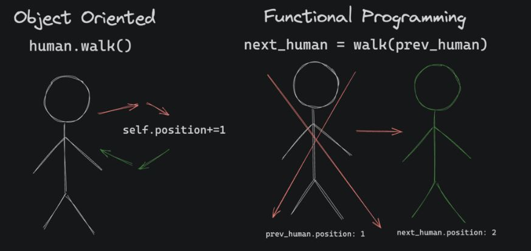

# Fundamentals of Classes

## Classes and instances

Just like a string, integer or float, a class is a type, but instead of being a built-in type, classes are custom types that you define. So if a class is a new custom type, what's an object? Objects are just [instance](https://stackoverflow.com/questions/20461907/what-is-meaning-of-instance-in-programming/79673597#79673597)s of a class.

## Methods

A method is just a function that's tied directly to a class and has access to its properties. Methods are defined within the `class` declaration. Their first parameter is always the instance of the class that the method is being called on. By convention, it's called "self", and because `self` is a reference to the object, you can use it to read and update the properties of the object.

A method can operate on data that is contained within the class. For this reason they often don't return anything because they can mutate (update) the properties of the object instead.

## Constructors

To define properties (instance variables) on a class, a constructor can be used.  It's a specific method on a class called `__init__` that is called automatically when you create a new instance of a class. A constructor is a safe way to define properties and it also allows us to make the starting property values configurable.

**Example with NO constructor:**
```python
class Soldier:
    name = "Legolas"
    armor = 2
    num_weapons = 2

# Only possible instance is:
soldier = Soldier()
```

**Example with constructor:**
```python
class Soldier:
    def __init__(self, name, armor, num_weapons):
        self.name = name
        self.armor = armor
        self.num_weapons = num_weapons

# Instances can vary:
soldier_one = Soldier("Legolas", 2, 10)
print(soldier_one.name)
# prints "Legolas"
print(soldier_one.armor)
# prints "2"
print(soldier_one.num_weapons)
# prints "10"

soldier_two = Soldier("Gimli", 5, 1)
print(soldier_two.name)
# prints "Gimli"
print(soldier_two.armor)
# prints "5"
print(soldier_two.num_weapons)
# prints "1"
```

## Class vs instance variables

Instance variables vary from object to object and are **declared in the constructor**. They are more common:
```python
class Wall:
    def __init__(self):
        self.height = 10 

south_wall = Wall()
south_wall.height = 20 # only updates this instance of a wall
```

Class (or static) variables are shared between instances of the same class and are **declared at the top level of a class definition**. They are less common:
```python
class Wall:
    height = 10 

south_wall = Wall()
Wall.height = 20 # updates all instances of a Wall
```

Generally speaking, stay away from class variables unless they are [constants](https://realpython.com/python-constants/#defining-your-own-constants-in-python). Just like global variables, class variables are usually a bad idea because they make it hard to keep track of which parts of your program are making updates. Also, avoid declaring instance variables inside methods other than `__init__`.

---

# Encapsulation

Encapsulation reduces complexity by separating an object's interface (its inputs and outputs) from its implementation (how it works internally). It achieves this by bundling related data (attributes) and the methods that operate on them into a single unit — the class.  Additionally, it safeguards the object's internal state by restricting direct access, preventing unintended modifications. This is achieved by marking variables as private and exposing controlled interactions through public methods.

## Public and Private

* **Public** methods/attributes can be accessed from **outside** the class.
* **Private** methods/attributes can only be accessed from **within** the class.

By default, all properties and methods in a class are public, meaning they can be accessed using the `.` operator. To encapsulate data and logic within a class and restrict external access, prefix a property or method name with two underscores (`__`) to make it [private](https://docs.python.org/3/tutorial/classes.html#tut-private).


```python
class Wall:
    def __init__(self, armor, magic_resistance):
        self.__armor = armor
        self.__magic_resistance = magic_resistance

    def get_defense(self):
        return self.__armor + self.__magic_resistance

front_wall = Wall(10, 20)

# This results in an error
print(front_wall.__armor)

# This works
print(front_wall.get_defense())
# 30
```

## Encapsulation != security

Encapsulation and the concepts of private and public members have NOTHING to do with security. Just as the casing on your computer hides its inner workings but doesn't stop you from opening the case and looking inside, encapsulation doesn't stop anyone from knowing how your code works, it just puts it all in one easy to find place.

## Encapsulation in Python

Python is a very dynamic language, which makes it difficult for the interpreter to enforce some of the safeguards that languages like Go do. That's why encapsulation in Python is achieved mostly by convention rather than by force.

Prefixing methods and properties with a double underscore is a strong suggestion to the users of your class that they shouldn't be touching that stuff. If a developer wants to break convention, there are ways to [get around the double underscore rule](https://stackoverflow.com/questions/3385317/private-variables-and-methods-in-python).

---

# Abstraction 

Abstraction helps us handle complexity by hiding unnecessary details. It is a more general term for "making something easier to use by adding a layer on top".

**Abstraction vs encapsulation**

Academics love to split hairs about definitions... but in practice, we're basically talking about the same thing here.
The terms "abstraction" and "encapsulation" mostly just emphasize different aspects of the same concept

- Abstraction is about creating a simple interface for complex behavior. It focuses on what's exposed (public).
- Encapsulation is about hiding internal state. It focuses on tucking away the implementation details (private).

Abstraction is more about reducing complexity, encapsulation is more about maintaining the integrity of system internals.  When writing libraries for other developers to use, getting the abstractions right is critical because changing them later can break thousands of applications around the world that rely on it.

## How OOP Developers Think
Classes in object-oriented programming are all about grouping data and behavior together in one place: an object. Object-oriented programmers tend to think about programming as a modeling problem: "How can I write a `Human` class that holds the **data** and simulates the **behavior** of a real human?"

To provide some contrast, functional programmers tend to think of their code as inputs and outputs, and how those inputs and outputs transition the world from one state to the next: "My game has 7 humans in it. When one takes a step, what's the next state of the game?"



---

# Inheritance

Non-OOP languages like Go and Rust support encapsulation and abstraction... almost every language does. Inheritance, on the other hand, is typically unique to class-based languages like Python, Java, and Ruby. Inheritance allows a "child" class, to inherit properties and methods from "parent" class. It's a way to share code between classes. For example:

```python
class Aircraft:
    def __init__(self, height, speed):
        self.height = height
        self.speed = speed

    def fly_up(self):
        self.height += self.speed

class Jet(Aircraft):
    def __init__(self, speed):
        # Jets always start on the ground: zero height
        super().__init__(0, speed)

    def go_supersonic(self):
        self.speed *= 2
```

By adding `Aircraft` in parentheses after `Jet`, we're saying "make `Jet` a child class of `Aircraft`". Now `Jet` inherits all the **properties and methods** of `Aircraft`! The `super()` method returns a proxy of the parent class, meaning we can use it to call the parent class's constructor and other methods. 

## When to inherit

The rule of thumb is: `A should only inherit from B if A is always a B.`

For example:
- `Cat` should inherit from `Animal` because a cat is always an animal.
- `Truck` should inherit from `Vehicle` because a truck is always a vehicle.
- `Cat` should not inherit from `Dog` because a cat is not always a dog.
- `Animal` should not inherit from `Cat` because an animal is not always a cat.

When a child class inherits from a parent, it inherits everything. If you only want to share some functionality, inheritance should not be the tool you use. 

## Calling a parent class using `super()`

Use `super()` to access methods or properties from the parent class inside a child class. This is useful when you want to extend or customize the behavior of a method without completely rewriting it.

```python
class Animal:
    def __init__(self, name):
        self.name = name

    def speak(self):
        return f"{self.name} makes a sound."

class Dog(Animal):
    def __init__(self, name, breed):
        super().__init__(name)  # calls Animal.__init__
        self.breed = breed

    def speak(self):
        parent_sound = super().speak()  # calls Animal.speak
        return f"{parent_sound} {self.name} barks."
```

Calling `super()` ensures the parent class's behavior is preserved while allowing the child to add or override functionality.

---

# Polymorphism

Polymorphism is the ability of a variable, function or object to take on multiple forms.

- "poly" = "many"
- "morph" = "form"

For example, classes in the same hierarchical tree may have methods with the same name and signature but different implementations. Here's a simple example:

```python
class Creature():
    def move(self):
        print("the creature moves")

class Dragon(Creature):
    def move(self):
        print("the dragon flies")

class Kraken(Creature):
    def move(self):
        print("the kraken swims")

for creature in [Creature(), Dragon(), Kraken()]:
    creature.move()
# prints:
# the creature moves
# the dragon flies
# the kraken swims
```

Because all three classes have a `.move()` method, we can shove the objects into a single list, and call the same method on each of them, even though the implementation (method body) is different.

## Operator Overloading

Another kind of built-in polymorphism in Python is the ability to override how an operator works. For example, the `+` operator works for built-in types like integers and strings. Custom classes on the other hand don't have any built-in support for those operators:
```python
class Point:
    def __init__(self, x, y):
        self.x = x
        self.y = y


p1 = Point(4, 5)
p2 = Point(2, 3)
p3 = p1 + p2
# TypeError: unsupported operand type(s) for +: 'Point' and 'Point'
```

But we can add our own support! If we create an `__add__(self, other)` method on our class, the Python interpreter will use it when instances of the class are being added with the `+` operator. Here's an example:

```python
class Point:
    def __init__(self, x, y):
        self.x = x
        self.y = y

    def __add__(self, point):
        x = self.x + point.x
        y = self.y + point.y
        return Point(x, y)

p1 = Point(4, 5)   # (4, 5)
p2 = Point(2, 3)   # (2, 3)
p3 = p1 + p2       # calls Point.__add__(p1, p2) → (6, 8)
```

Now, when `p1 + p2` is executed, under the hood the Python interpreter just calls `p1.__add__(p2)`.
