<h1>Welcome to my SQL Guide</h1>

Choose your topic from the list below

- [SQL Server in Docker](#sql-server-in-docker)
  - [Volumes Required](#volumes-required)
    - [Managing Permissions](#managing-permissions)
  - [Containerize SQL Server](#containerize-sql-server)
    - [Authentication](#authentication)
    - [Run](#run)
    - [Run with --env-file](#run-with---env-file)
  - [Querying](#querying)
    - [Interactive Terminal](#interactive-terminal)
    - [Command Line Queries](#command-line-queries)
    - [Script Files](#script-files)
  - [Security](#security)
    - [Admin User](#admin-user)
- [Migrations: Database Reproducibility](#migrations-database-reproducibility)
  - [Designing Safe Migrations](#designing-safe-migrations)
    - [Multi-phase Deployment](#multi-phase-deployment)
    - [Reversible Migrations](#reversible-migrations)
  - [Migration Tools](#migration-tools)
    - [High-level Workflow](#high-level-workflow)
    - [Flyway](#flyway)
      - [Common Workflows with Flyway](#common-workflows-with-flyway)
      - [Installation](#installation)
      - [Setup](#setup)
      - [Down Migrations](#down-migrations)
      - [Flyway with SQL Server and Docker](#flyway-with-sql-server-and-docker)
      - [ERROR: Validate failed](#error-validate-failed)
  - [Migrate Everything?](#migrate-everything)
- [Backups: Database Recovery](#backups-database-recovery)
  - [Backups for Dockerized SQL Server](#backups-for-dockerized-sql-server)
    - [Create a Backup](#create-a-backup)
    - [Store Backup to a Volume](#store-backup-to-a-volume)
- [Constraints](#constraints)
  - [Primary \& Foreign Keys](#primary--foreign-keys)
- [Table Relationships](#table-relationships)
- [Database Architectures](#database-architectures)
  - [OLTP](#oltp)
    - [ACID Transactions in SQL Server](#acid-transactions-in-sql-server)
      - [Atomic: Transaction Modes](#atomic-transaction-modes)
        - [Managing Transactions](#managing-transactions)
        - [Error Handling](#error-handling)
        - [Nested Transactions \& Savepoints](#nested-transactions--savepoints)
      - [Isolation: Concurrent Data Access](#isolation-concurrent-data-access)
        - [SET TRANSACTION ISOLATION LEVEL](#set-transaction-isolation-level)
        - [DBCC USEROPTIONS](#dbcc-useroptions)
        - [Blocking](#blocking)
        - [Deadlocks](#deadlocks)
      - [Consistency \& Durability](#consistency--durability)
      - [Best Practices](#best-practices)
    - [Normalization](#normalization)
      - [1NF](#1nf)
      - [2NF](#2nf)
      - [3NF](#3nf)
      - [BCNF](#bcnf)
  - [OLAP](#olap)
    - [Dimensional Modelling](#dimensional-modelling)
      - [Grain](#grain)
        - [Choosing Grain](#choosing-grain)
      - [Designing Fact Tables](#designing-fact-tables)
        - [Signs of a Poorly Designed Fact Table](#signs-of-a-poorly-designed-fact-table)
      - [Designing Dimensions](#designing-dimensions)
        - [Hierarchies Enable Drill-down](#hierarchies-enable-drill-down)
        - [Date and Time Dimensions](#date-and-time-dimensions)
        - [Degenerate Dimensions](#degenerate-dimensions)
        - [Signs of a Poorly Designed Dimension](#signs-of-a-poorly-designed-dimension)
      - [Star Schema Relationships](#star-schema-relationships)
      - [Naming Conventions](#naming-conventions)
    - [Denormalization](#denormalization)

---

# SQL Server in Docker

## Volumes Required

While a database can run inside a container, its data must exist outside the container’s lifecycle, such as in volumes. <br>
Three things to persist in a SQL Server container:

1. Data
2. Logs (SQL Server Logs, not database transaction logs which are stored alongside the data)
3. Secrets

Each corresponds to a separate volume - a directory on the host mapped into the container.

### Managing Permissions

[SQL Server images](https://mcr.microsoft.com/en-us/catalog?search=sql%20server) run on Linux-based containers. This means that to persist data, the container’s Linux file system must be mapped to the host file system. It’s best to map a Linux container file system to a Linux host file system. On Windows, this requires using WSL, since mapping a Linux container directly to the Windows file system can lead to performance issues. Another option is to use [docker-managed volumes](https://www.youtube.com/watch?v=p2PH_YPCsis) which automatically stores data in a Linux-native filesystem. Regardless of the approach, SQL Server containers require that the container’s internal user (i.e., `mssql`) has write access to the mounted directories.

SQL Server images on Linux do not run as root by default. Although Docker can mount volumes normally, the `mssql` user inside the container must have ownership of — or write access to — the mounted volumes. If it doesn’t, the SQL Server boot process cannot write system database files, causing the container to exit with an “Access is denied” error. Since the container runs as UID 10001, any mounted volume must either be **owned by that user** or have **write permissions granted** so that `mssql` can access it. While adjusting write permissions with `chmod` is technically sufficient, particularly for development or testing setups, ownership is safer and ensures that only the `mssql` user inside the container can write to the directories. Therefore, the recommended approach is to set `mssql` as the owner of the volume before starting the container.

Create the volume directories at a host path of your choice: 
```bash
mkdir -p <host_sqlserver_volume_path>/{data,log,secrets}
```

You then have two options:

1. Production-safe 
   
   Set ownership on that host path for the SQL Server container user (UID 10001) and restrict permissions to owner and group: 

   ```bash
   # Change owner and group to mssql
   sudo chown -R 10001:10001 <host_sqlserver_volume_path>

   # Restrict permissions to owner (mssql) and group (still mssql)
   sudo chmod -R 770 <host_sqlserver_volume_path>
   ```
   * Only the mssql user inside the container can write
   * Recommended for production and long-term use
  
2. Development-only
   
   Set ownership to `mssql` and grant full write permissions to everyone (revert before going live):

    ```bash
    sudo chown -R 10001:10001 <host_sqlserver_volume_path>
    sudo chmod -R 777 <host_sqlserver_volume_path>
    ```
    * Any user on the host or process can write to the directories
    * Works for quick experiments or testing, but not safe for production

## Containerize SQL Server

### Authentication

There are two primary ways of authenticating SQL Server
1. SQL Server Authentication: uses a SQL Server–specific username and password (e.g., `sa` or any user you create).
2. Windows Authentication: uses your Windows (or Active Directory) credentials - no separate username/password needed in SQL Server itself.

When running SQL Server in containers, SQL Server Authentication is recommended. Windows Authentication is mostly only practical if your container runs on Windows Server containers and is joined to a domain.

### Run

For SQL Server, `/var/opt/mssql/` is where database files live inside the container, so this is where we will be mounting volumes. Ensure the SA password meets SQL Server requirements — at least 8 characters including uppercase, lowercase, digits, and special characters — otherwise the container may exit with the error: Unable to set system administrator password.

```bash
docker pull mcr.microsoft.com/mssql/server:<tag>

docker run -d \
  --name <container_name> \
  -e ACCEPT_EULA=Y \
  -e MSSQL_SA_PASSWORD='<password>' \
  -p <host_port>:1433 \
  -v <host_sqlserver_volume_path>/data:/var/opt/mssql/data \
  -v <host_sqlserver_volume_path>/log:/var/opt/mssql/log \
  -v <host_sqlserver_volume_path>/secrets:/var/opt/mssql/secrets \
  mcr.microsoft.com/mssql/server:<tag>

# Confirm setup was successfull
docker logs <container_name>
```
* `-e`: Passes [environment variables](https://learn.microsoft.com/en-us/sql/linux/sql-server-linux-configure-environment-variables?view=sql-server-ver17) into the container at runtime. SQL Server uses these to configure itself on startup, such as accepting the EULA (end-user license agreement) and setting the `sa` (system administrator) password. 
* `-v`: Mounts a directory from the host into the container.
* `-p <host_port>:1433`: exposes the container’s SQL Server to your host, allowing you to connect to it from SSMS or any SQL client on your machine. 

### Run with --env-file

You can create a simple `.env` file for Docker to store environment variables like the SA password, EULA acceptance, and any other configuration. Docker will automatically read all the variables from `.env` file and sensitive info (like SA password) will be kept out of your command history.

1. Create `.env` file (e.g. `mssql.env`)
   
```bash
touch mssql.env
```

2. Add environment variables inside
   
```bash
# Accept SQL Server EULA
ACCEPT_EULA=Y

# SA password 
MSSQL_SA_PASSWORD=<password>
```
Tip: Make sure there are no spaces around `=` and no quotes around the values.

3. Use the `.env` file when running the container
   
```bash
docker run -d \
--name <container_name> \
--env-file <path_to_env_file>/mssql.env \
-p <host_port>:1433 \
-v <host_sqlserver_volume_path>/data:/var/opt/mssql/data \
-v <host_sqlserver_volume_path>/log:/var/opt/mssql/log \
-v <host_sqlserver_volume_path>/secrets:/var/opt/mssql/secrets \
mcr.microsoft.com/mssql/server:<tag>
```

## Querying

Microsoft provides a command-line tool called `sqlcmd` for interacting with SQL Server databases, whether on the host or inside a running container. Note that not all SQL Server images include this tool by default. To use it inside a container, you may need to switch to the root user (since the container runs as `mssql` and lacks permission) and install the `mssql-tools` package.

```bash
# Run container as root
docker exec -it --user root <container_name> bash

# Install mssql-tools
apt-get update
apt-get install -y mssql-tools unixodbc-dev
```

Once `mssql-tools` is installed, `sqlcmd` will be available at `/opt/mssql-tools/bin/sqlcmd`, allowing us to access the database in several ways

### Interactive Terminal

```bash
docker exec -it <container_name> \
/opt/mssql-tools/bin/sqlcmd \
-S <server> \
-U <username> \
-P '<password>' \
-C
```
* `docker exec -it` → run interactively inside the container
* `/opt/mssql-tools/bin/sqlcmd` → path to the tool inside SQL Server image
* `-S` → server name or IP (for local Docker: `localhost,1433`)
* `-U` → SQL login (`sa` by default)
* `-P` → password
* `-C` → Trusts the self-signed SSL certificate (for a local docker container without TLS, you can omit this).


Then you can type queries, ending each with `GO`:
```sql
CREATE DATABASE TestDB;
GO
SELECT name FROM sys.databases;
GO
```
* `GO` → Tells SQL Server to execute the command.

When finished, exit the interactive session with:
```sql
QUIT
```
    
### Command Line Queries

```bash
docker exec <container_name> \
/opt/mssql-tools/bin/sqlcmd \
-S <server> -U <username> -P '<password>' -C \
-Q "<query_code>;"
```
* `-Q` → runs the query and exits

### Script Files

```bash
docker exec <container_name> \
/opt/mssql-tools/bin/sqlcmd \
-S <server> -U <username> -P '<password>' -C \
-i /path/to/script.sql
```
* `-i` → runs queries from `script.sql`

The `-i /path/to/script.sql` expects the script to exist inside the container. If it’s on the host, you must mount the directory as a volume when starting the container.

## Security

### Admin User

The `sa` user is a master key for SQL Server with unrestricted access. While convenient, it’s a major security risk: it has full system control, is a well-known attack target, and is frequently targeted by automated brute-force attempts. It's best to create a new admin user and disable `sa`.

```bash
# Run sqlcmd in interactive mode
docker exec -it <container_name> \
/opt/mssql-tools/bin/sqlcmd \
-S <server> \
-U <username> \
-P '<password>' \

# Create a new admin login
CREATE LOGIN <admin_user_name>
WITH PASSWORD = '<password>';
GO

# Grant sysadmin priviledges
ALTER SERVER ROLE sysadmin 
ADD MEMBER <admin_user_name>;
GO

# Ensure new admin works
SELECT name FROM sys.sql_logins 
WHERE name = '<admin_user_name>';
GO

# Disable sa
ALTER LOGIN sa DISABLE;
GO
```

# Migrations: Database Reproducibility

Database reproducibility refers to the ability to reliably recreate a database environment — including its schema, data, and configuration — so that it behaves the same way across different systems, times, or stages of development. This is typically achieved using [migrations](https://en.wikipedia.org/wiki/Schema_migration). A database migration is a change to the structure of a relational database. You can think of it like a commit in Git, but for your database schema. Every migration records how the structure of your data evolves over time.

* 🚫 The Wrong Way to Migrate

    Making schema changes directly on a live database is risky. If you manually modify the production database — for example by running `ALTER TABLE` commands — those changes exist only in that database. There’s no reliable record of what changed, no easy way to apply the same changes to development or staging databases, and no clear way to undo them if something goes wrong.

* ✅ The Right Way to Migrate

    Instead, describe every schema change in a migration file: a small, explicit script that says how the database structure should change. These files are saved with your code and applied in order to each environment (development, staging, production). By doing this, the database schema evolves in a controlled, repeatable way. Everyone runs the same steps, the schema stays aligned with the code, and the full history of changes is preserved — much like version control, but for the database structure.

**Why not just use Git?** 

Git alone can’t manage a database’s state. It only tracks files, so it has no awareness of which schema changes have actually been applied. Migration tools, by contrast, aren’t meant to track SQL code itself - Git already does that. Their purpose is to track the database state: which schema changes (tables, columns, constraints, defaults, and so on) have been applied, in what order, and whether they can be rolled back. Git manages the files; migrations manage the database.

Nevertheless, Git is key for migrations because it versions the migration files alongside the application code. When we create a migration file for a specific application version, Git commits it alongside the code. Pushing these files to a remote repository ensures the deployment process can access them, keeping the database schema in sync with the deployed code.

## Designing Safe Migrations

Our system should automatically run database migrations whenever we deploy new code (e.g., through a CI/CD pipeline). This ensures that the database schema is always in sync with the code. It also makes it easy to set up new databases in any environment:
* If we need a fresh copy of the database for testing or staging, running all migrations in order will recreate the schema exactly as in production.
* If we want to set up a local development environment, running the migrations will build the correct database structure without manually creating tables or columns.

Good migrations are small, incremental and ideally reversible changes to a database. **A good migration considers two key things:**
1. **The old**, currently running version of the code 
2. **The new** version of the code that will run after the migration is complete

### Multi-phase Deployment

If you apply a database migration that doesn’t match the code currently running in production, the app may break. Similarly, if you deploy new code that expects a different database schema than what’s currently in place, the app can also fail. The solution to the schema-code mismatch problem is a multi-phase deployment:
1. **Expand phase** – Apply changes that are safe with both old and new code (e.g., adding a new column without removing the old one).
2. **Deploy new code** – Release the new version of the application while the database has been safely expanded, ensuring the schema supports both the old and new code during the migration.
3. **Contract phase** – Once the new code is running everywhere, run a clean-up migration to remove or modify old structures that are no longer needed.

**Updating existing columns** requires extra caution. Avoid directly renaming or modifying a column. Instead, do another multi-phase deployment:
1. Create a new column
2. Copy data from the old column into the new one
3. Deploy code that uses the new column (while the old column still exists for the old, currently running version of the app to use).
4. Recopy data from the old column to the new column to catch any changes made between the first copy and the deployment.
5. Run a migration to remove the old column.

**Last resort:** If multi-phase deployment isn’t feasible, schedule downtime so users are aware that the app will be temporarily unavailable while the changes are applied safely.

### Reversible Migrations

To manage migrations, we use a simple system based on **up** and **down** directions.
* The **up** migration applies changes to move your schema forward.
  
    ```sql
    -- Migrate up
    ALTER TABLE transactions
    ADD COLUMN transaction_type TEXT;
    ```

* The **down** migration rolls those changes back to the previous state. 
  
    ```sql
    -- Migrate down
    ALTER TABLE transactions
    DROP COLUMN transaction_type;
    ```

## Migration Tools

As we've seen in the [reversible migrations](#reversible-migrations) section, we create an 'up migration' to apply a change. If we later need to revert it, we create a separate 'down migration'. Each migration is written in its own file, essentially a script containing SQL code. A migration tool processes these files, applying or reverting the schema based on the command provided.

| Tool    | Language(s)                  | Notes                                                                 |
|---------|-----------------------------|----------------------------------------------------------------------|
| [Flyway](https://github.com/flyway/flyway)  | Java (also language-agnostic) | Executes plain SQL scripts; cloud-ready; CI/CD-friendly |
| [Alembic](https://alembic.sqlalchemy.org/en/latest/index.html) | Python                      | Designed for SQLAlchemy; supports migrations written in Python or SQL |
| [Goose](https://pressly.github.io/goose/?utm_source=chatgpt.com)   | Go                          | Native Go tool; primarily SQL-based but also allows Go functions for migrations |

### High-level Workflow

*Each tool’s workflow varies - some don’t support down migrations, and rollbacks are handled differently - but the general procedure is:*

1. Write migration files.
   
   * `001_add_columns_to_transactions.up.sql`
   * `001_add_columns_to_transactions.down.sql`

    The `.up.sql` file defines the changes to apply to the database, while the `.down.sql` file defines how to revert those changes.

2. Apply them using a CLI:
   
    ```bash
    migrate up
    ```

    This command tells the migration tool to:
    * Look at all migration files in order (e.g. `001_*.up.sql`)
    * Check its migration history table in the database
    * Find which migrations have not been applied yet
    * Execute the corresponding `.up.sql` files against the database, in order
    * Record each successful migration in the history table so it won’t run again

    In effect, this brings the database schema up to the latest version. If we were to `migrate down`, the procedure would essentially be the same, but in reverse.

### Flyway

Flyway executes migration files exactly once and in order. It works alongside any programming language — your program doesn’t need to communicate with Flyway directly. Flyway manages the database migrations, and your program simply connects to the already-migrated database.

#### Common Workflows with Flyway

* Run Flyway in CI/CD before starting the application
* Run in Docker alongside the application (Flyway container + app container)
* Run as a startup step (shell script → Flyway → application)

#### Installation

There are two main options for using Flyway:

1. Local: [Download flyway from Redgate](https://www.red-gate.com/products/flyway/community/download/) and install on your host
2. Docker: Pull the `flyway/flyway` [official Docker image](https://hub.docker.com/r/flyway/flyway) from Docker Hub 

#### Setup

1. File naming

    After writing our migration code, Flyway expects it to be saved as a `.sql` file and named in the following format: `V<version_number>__<script_name>.sql`

    For example: `V1__create_users_table.sql`
    * `V1` → version 1 (first change)
    * `__` → double underscore separator
    * rest → description (for humans)

2. Project structure

    Flyway's config file is placed in our project's root, and migration files are usually kept in a dedicated directory (often called `db`, `migrations`, or `sql`) 

    ```bash
    project/
    ├── migrations/
    │   ├── V1__create_users_table.sql
    │   └── V2__add_email_to_users.sql
    └── flyway.conf
    ```

3. Config

    A typical Flyway configuration file (like `flyway.conf`) contains key-value pairs that tell Flyway *how to connect to the database* and *where to find migration files*. 

    ```conf
    # Database connection
    flyway.url=jdbc:<DRIVER>://<YOUR_SERVER_HOST>:<YOUR_SERVER_PORT>;databaseName=<YOUR_DATABASE_NAME>
    flyway.user=<YOUR_DB_USERNAME>
    flyway.password=<YOUR_DB_PASSWORD>

    # Where Flyway looks for migration files
    flyway.locations=filesystem:<PATH_TO_CONTAINER_MIGRATIONS_FOLDER>

    # Optional: manage a specific schema (dbo by default)
    flyway.schemas=<YOUR_SCHEMA_NAME_OR_DBO>

    # Optional: treats existing DB tables as baseline so migrations start tracking from now
    flyway.baselineOnMigrate=<true_or_false>

    # Optional: file naming convention (default is V<version>__<description>.sql)
    # flyway.sqlMigrationPrefix=V
    # flyway.sqlMigrationSeparator=__
    # flyway.sqlMigrationSuffix=.sql
    ```

#### Down Migrations

[Flyway's free edition](https://documentation.red-gate.com/flyway/deploying-database-changes-using-flyway/deployment-approaches-with-flyway/migrations-based-approach) is primarily forward-migration oriented. It does not have built-in undo migrations; you have to manually create them and apply them as normal migrations.

```bash
project/
└─ migrations/
   ├─ V1__create_users_table.sql
   ├─ V2__add_email_column.sql
   └─ V3__remove_email_column.sql   <-- our "down" migration
```

Essentially, “down” is just another forward migration moving the schema to a previous state. After running, Flyway applies V1, V2, then V3. V3 effectively rolls back the email column addition.

#### Flyway with SQL Server and Docker

Working with Flyway and SQL Server usually involves **two separate containers**
1. The SQL Server container is **stateful** - a long-running container that persists database data by writing to a volume
2. The Flyway container is **stateless** — a temporary container that reads migration scripts from a mounted volume, applies them, and then exits

You don’t bake migrations into the SQL Server container; instead, Flyway connects to the running SQL Server container via a JDBC connection to apply them. 

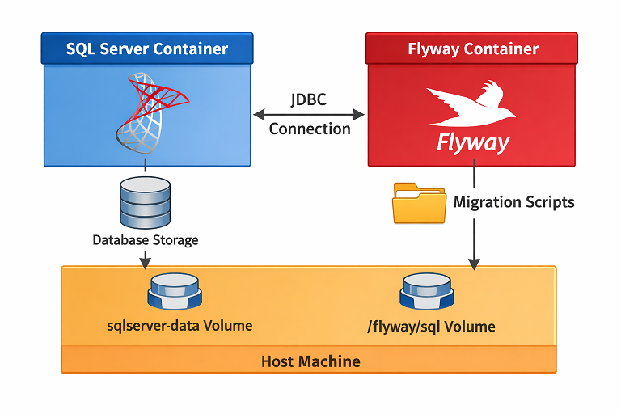

Assuming a *SQL Server container is already running*, you run Flyway as a one-off container that connects to it:

1. **Create a `flyway.conf` file on your host**
   
    ```conf
    flyway.url=jdbc:sqlserver://<host>:1433;databaseName=<YOUR_DATABASE_NAME>
    flyway.user=<YOUR_DB_USERNAME>
    flyway.password=<YOUR_DB_PASSWORD>
    flyway.locations=filesystem:/flyway/sql

    # Notes for `<host>`:
    # - Use `host.docker.internal` if connecting via the host (host SQL Server or container exposed to host)  
    # - Use the container name if connecting container-to-container on a custom Docker network
    ```

2. **Create a volume for migration scripts**
   
   ```bash
   mkdir migrations
   ```

3. **Run Flyway container and mount both the config file and the migrations**

    **Option A:** Run the container each time you want to migrate

    ```bash
    docker run --rm \
      -v <migrations_path>:/flyway/sql \
      -v <path_to_flyway.conf>:/flyway/conf/flyway.conf \
      flyway/flyway migrate
    ```

    **Option B:** Save as `migrate.sh` and just run `./migrate.sh` whenever you need to migrate
    ```bash
    #!/bin/bash
    docker run --rm \
      -v <migrations_path>:/flyway/sql \
      -v <path_to_flyway.conf>:/flyway/conf/flyway.conf \
      flyway/flyway migrate
      ```

    **Option C:** [Use Docker Compose](sqlserver-docker-flyway.md)

***Note:** When coordinating multiple containers, it's best to use something like Docker Compose*

#### ERROR: Validate failed

This error happens when Flyway detects that a migration you already applied has changed since it was first run. If you modify the migration script after it has already been applied, Flyway sees that the applied migration doesn’t match the local file and refuses to continue because this could break the database. 

To resolve:

1. **Revert the migration file** (ideally using version control) so it matches what was applied.
2. If the metadata table is out of sync or you intentionally want to accept the changes, run: `flyway repair`
  
    After repair, you can set a new baseline with: `flyway baseline`. This lets Flyway continue safely from the updated baseline without re-running or breaking existing migrations.

**Note:** `repair` only works safely in development. It updates Flyway’s schema history table to match the current files without changing the database, but should **never** be used in production, where migration history must remain immutable.


## Migrate Everything?

Migrations should include only SQL that changes the database’s structure or essential reference data—such as creating or altering tables, adding indexes or constraints, and inserting or updating baseline data your app depends on. Routine transactional operations, like modifying user or business data, as well as ad-hoc reporting or `SELECT` queries, do not belong in migrations. The rule of thumb is to migrate **schema and essential baseline data**, not everyday application queries.

A good set of migrations should allow you to delete your database and recreate it from scratch. If you can’t do that, it’s a sign something important was missed.

# Backups: Database Recovery

For data recovery, the most obvious solution is a backup, which preserves the actual data at a specific point in time and becomes relevant only once there is data worth protecting. When using Docker volumes, it may be tempting to think that backups are unnecessary, but you often need to restore to a point in time, not just “whatever is in the volume right now". You may then assume that going back to a previous state can be achieved using down migrations, but migrations describe structure, not data history, and therefore cannot reliably restore lost or corrupted data.

The goal of a backup is to be able to restore data to a known good state when something goes wrong.

## Backups for Dockerized SQL Server

A backup is a point-in-time snapshot of the database created with SQL Server tools or scripts (`.bak` file). It doesn’t automatically update — it only captures the state when it was created. In Docker, *backups should persist* outside the container, in a volume (which is just a directory on the host mapped into the container). The goal is to ensure the backup survives container restarts, upgrades, or deletions.

### Create a Backup 

Backups can be created using the container’s SQL Server tools .  

```bash
# Generates a .bak file for your backup
docker exec <container_name> /opt/mssql-tools/bin/sqlcmd \
-S <server> -U <username> -P "<password>" -C \
-Q "BACKUP DATABASE [<db_name>] TO DISK = N'/var/opt/mssql/data/<db_name>.bak' WITH INIT, FORMAT;"
```
* `TO DISK` specifies that the backup should be written to a file on disk.
  * Alternative: `TO TAPE` (for tape backups) or `TO URL` (for Azure blob storage).
* `N'/var/opt/mssql/data/<db_name>.bak'` specified the path and filename of the backup file.
  * `N'...'` → prefix `N` means it’s a Unicode string, which is a SQL Server convention (important if your path contains non-ASCII characters).
  * In Docker Linux containers, `/var/opt/mssql/data/` is the default data directory inside the container.
* `WITH INIT` initializes the backup file, overwriting any existing content.
  * Without `INIT`, SQL Server would append the new backup to the file (creating a backup set) instead of replacing it.
* `WITH FORMAT` formats the backup media, creating a new media header.
  * This is required if you want to completely overwrite an existing file and start fresh.
  * Often used together with `INIT` for a clean, standalone backup.


### Store Backup to a Volume

After creating the backup file, we need to get it out of the container. If you modified directory permissions during [volume setup](#managing-permissions), you may need to use `sudo` to copy the backup into the volume:

```bash
# Copy the backup out of the container and into the volume
sudo docker cp <container_name>:/var/opt/mssql/data/<db_name>.bak <host_path>/<db_name>.bak
```

*Note: The **safest approach** is to store the backup both in a volume and on external storage.*


# Constraints 

Constraints are rules applied to a table’s columns to enforce data integrity. They ensure that data meets specific conditions and prevent invalid entries. If these rules are violated, an error is raised, and the data is not entered into the database.

Constraints can be defined when **creating a table**

```sql
CREATE TABLE employees (
    id INT PRIMARY KEY,
    -- PRIMARY KEY uniquely identifies each employee

    name NVARCHAR(100) UNIQUE,
    -- UNIQUE ensures no two employees have the same name

    title NVARCHAR(100) NOT NULL,
    -- NOT NULL ensures the title cannot be empty

    salary DECIMAL,
    country NVARCHAR(100)
);
```

or added later by **altering an existing table**. In SQL Server, any constraint added with `ALTER TABLE` must have a name, and when adding a `DEFAULT`, the target column must also be specified

```sql
ALTER TABLE employees
ADD CONSTRAINT check_salary CHECK (salary >= 0);
-- CHECK ensures salary is non-negative

ALTER TABLE employees
ADD CONSTRAINT df_country DEFAULT 'Cyprus' FOR country;
-- DEFAULT provides a default value if none is given
```

**Note:** A single column can have **multiple constraints** applied at the same time (e.g., `NOT NULL`, `UNIQUE`, `CHECK`) either inline during `CREATE TABLE` or via separate `ALTER TABLE` statements.

## Primary & Foreign Keys

A key defines and protects relationships between tables. 

A `PRIMARY KEY` is a special column that uniquely identifies each record within a table. Each table can have **only one primary key**. It’s very common to name this column `id`, and it is almost always the primary key for the table. No two rows can share the same `id`. By definition, a primary key is always `NOT NULL`.

`FOREIGN KEY`s are what make relational databases relational. A foreign key is a column in one table that references the primary key of another table. This means that that *any value inserted into the foreign key column must already exist in the referenced column*. What's more, a foreign key does not automatically enforce `NOT NULL`, and it does not always have to be non-null. For example, a `books` table might allow books with unknown authors — in the example below, author_id can be `NULL`.

```sql
CREATE TABLE authors (
    id INT PRIMARY KEY
    -- PRIMARY KEY
);

CREATE TABLE books (
    id INT PRIMARY KEY,
    -- PRIMARY KEY for books

    author_id INT,
    CONSTRAINT fk_authors FOREIGN KEY (author_id) REFERENCES authors(id)
    -- FOREIGN KEY referencing authors
);
```

**Note:** In SQL Server, foreign keys can also be added after table creation using `ALTER TABLE`.


# Table Relationships

A relationship between tables assumes that one of these tables has a foreign key that references the primary key of another table. SQL describes relationships between tables in three ways:

| Relationship | Definition | Example |
|-------------------|---------------------------|---------|
| **One‑to‑One** | A one‑to‑one relationship means each record in one table matches with at most one record in another table. | Each **user** has exactly one **password**. |
| **One‑to‑Many** | A one‑to‑many relationship means one record in a table can be linked to many records in another table, but each of those records links back to only one parent. | One **customer** can place many **orders**, and each order belongs to one customer. |
| **Many‑to‑Many** | A many‑to‑many relationship means records in each table can be linked to multiple records in the other. | **Students** can enroll in many **courses**, and each course can have many students. |


- A one‑to‑one relationship often ends up represented simply as extra columns stored on the same row of a single table. For example, if each user has exactly one password, that password can be stored as an extra column (`password`) in the `Users` table rather than in a separate table.
- A one-to-many relationship is made explicit by adding a foreign key to the "many" side of the relationship. For example, in a system where one customer can place many orders, the `Orders` table includes a `customer_id` foreign key that points back to the `Customers` table.
  
  ```sql
  CREATE TABLE Customers (
      id INT IDENTITY PRIMARY KEY,
      name NVARCHAR(100) NOT NULL
  );

  CREATE TABLE Orders (
      id INT IDENTITY PRIMARY KEY,
      order_date DATE NOT NULL,
      customer_id INT NOT NULL, -- FK links Orders with Customers
      CONSTRAINT fk_orders_customer
          FOREIGN KEY (customer_id) REFERENCES Customers(id)
  );
  ```

- Many‑to‑many relationships occur via junction (joining) tables. For example, to represent the relationship between students and courses, we create a joining table called `student_courses` that stores the primary keys from both the `Students` and `Courses` tables. Then, when we want to check whether a student is enrolled in a specific course, we simply look in the joining table to see if the ids share a row.

  ```sql
  CREATE TABLE Students (
      id INT IDENTITY PRIMARY KEY,
      name NVARCHAR(100) NOT NULL
  );

  CREATE TABLE Courses (
      id INT IDENTITY PRIMARY KEY,
      title NVARCHAR(100) NOT NULL
  );

  -- Joining table
  CREATE TABLE student_courses (
      student_id INT NOT NULL,
      course_id INT NOT NULL,

      -- Composite primary key ensures each (student, course) pair appears only once
      CONSTRAINT pk_student_courses PRIMARY KEY (student_id, course_id),

      CONSTRAINT fk_student_courses_student
          FOREIGN KEY (student_id) REFERENCES Students(id),
      CONSTRAINT fk_student_courses_course
          FOREIGN KEY (course_id) REFERENCES Courses(id)
  );
  ```

# Database Architectures

Databases are designed to serve different needs: transactional operations (OLTP; Online Transaction Processing) or analytical insights (OLAP; Online Analytical Processing). OLTP systems handle day-to-day transactions with fast inserts, updates, and deletes, using highly normalized schemas to maintain data integrity. OLAP systems, in contrast, are optimized for querying, reporting, and analytics, often using dimensional models such as star or snowflake schemas to organize historical and aggregated data efficiently.

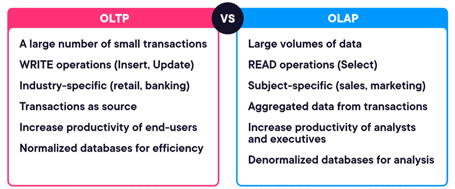

OLTP handles **more frequent operations**, but OLAP handles **more data overall**:
* OLTP databases focus on **many small, fast transactions** (like orders, payments, bookings). 
* OLAP databases focus on **aggregated and historical data** for analysis. They store **large volumes of transactional data over time** to generate insights, reports, and trends.

## OLTP

OLTP databases are used in systems where lots of small operations happen constantly — like banking, shopping carts, airline bookings, or inventory systems. These databases are **optimized for write operations**, making them ideal for applications with a **high number of concurrent users**, where user data must be retrieved, updated, or deleted **in real-time**.

So they must handle:
- **Insert** → adding new data (e.g., a new order)
- **Update** → modifying existing data (e.g., changing a seat reservation)
- **Delete** → removing data (e.g., canceling a booking)

And they must be:
- **Fast** → because users are waiting in real time
- **Reliable** → no data loss or corruption
- **Consistent** → the data must always make sense (no half-finished transactions)

OLTP databases ensure that every operation is ACID:
- **Atomic** (all or nothing)
- **Consistent** (rules are always followed)
- **Isolated** (transactions don’t interfere with each other)
- **Durable** (once saved, it stays saved)

**Example:** Transferring $100 to your wife — Atomicity: money leaves your account and enters your wife’s account; both steps must occur or none at all. Consistency: the $100 deducted from your account is exactly added to your wife’s account. Isolation: your neighbor’s transaction does not affect yours. Durability: once completed, the transfer persists even after a system crash, so confirmed data is never lost.

### ACID Transactions in SQL Server

Traditional SQL databases enforce ACID properties using transaction control commands such as `BEGIN`, `COMMIT`, and `ROLLBACK`, while mechanisms like transaction [logs](https://www.mssqltips.com/tutorial/what-is-the-transaction-log/) and [locks](https://medium.com/@thinunesc/understanding-locks-in-database-transactions-5cb156d67314) maintain data integrity and consistency.

#### Atomic: Transaction Modes

A transaction is a sequence of one or more SQL operations (such as inserts, updates, or deletes) executed as a single unit of work. If any operation fails, the entire transaction fails, preventing partial data from being stored. Transactions are the atomic unit in ACID, and together with the other ACID properties (consistency, isolation, and durability), they help maintain data integrity by ensuring that all changes can be undone using a rollback if an error occurs. In SQL Server, this behavior is further controlled through transaction modes, which define how transactions are started, managed, and committed.

**Auto-commit**
- This is the default mode used by most people without knowing.
- Every individual SQL statement (like `INSERT`, `UPDATE`, or `DELETE`) is treated as a separate transaction.
- Each statement is automatically committed if it succeeds, or rolled back if it fails.
- You don’t need to explicitly use `BEGIN TRANSACTION` or `COMMIT`.

```sql
-- This statement is automatically a transaction
UPDATE Accounts
SET Balance = Balance - 100
WHERE AccountID = 1;

-- This statement is a separate transaction
UPDATE Accounts
SET Balance = Balance + 100
WHERE AccountID = 2;
```

**Implicit transactions**
- In this mode, a transaction starts automatically when a modifying statement (like `INSERT`, `UPDATE`, or `DELETE`) is executed.
- The transaction stays open until you explicitly end it with `COMMIT` or `ROLLBACK`.
- You don’t need to use `BEGIN TRANSACTION` to start it.
- Useful when you want multiple statements to be part of a single transaction without explicitly starting it.
- You must remember to commit or roll back, otherwise changes remain uncommitted.

```sql
-- Turn on implicit transactions
SET IMPLICIT_TRANSACTIONS ON;

-- First modifying statement starts a transaction automatically
UPDATE Accounts
SET Balance = Balance - 100
WHERE AccountID = 1;

-- Second modifying statement continues the same transaction
UPDATE Accounts
SET Balance = Balance + 100
WHERE AccountID = 2;

-- Transaction is still open, must explicitly commit
COMMIT TRANSACTION;

-- or ROLLBACK if something went wrong
-- ROLLBACK TRANSACTION;
```

**Explicit transactions**
- You explicitly define the start of the transaction.
- All statements between `BEGIN TRANSACTION` and the end are part of the same transaction.
- You must explicitly end the transaction with `COMMIT` (to save changes) or `ROLLBACK` (to undo changes).
- Gives full control over multiple statements, ensuring atomicity across complex operations.
- Useful for business logic where several related changes must either all succeed or all fail.

```sql
-- Start an explicit transaction
BEGIN TRANSACTION;

-- First statement
UPDATE Accounts
SET Balance = Balance - 100
WHERE AccountID = 1;

-- Second statement
UPDATE Accounts
SET Balance = Balance + 100
WHERE AccountID = 2;

-- If everything is fine, save changes
COMMIT TRANSACTION;

-- If something went wrong, you could use:
-- ROLLBACK TRANSACTION;
```

##### <h4>Managing Transactions</h4>

To check how many open transactions exist in the current session, use `SELECT @@TRANCOUNT`. It returns the number of transactions that have been started but not yet committed or rolled back. This is especially useful when errors occur, as it lets you see if a transaction is still open and decide whether to roll it back. As a best practice, transactions should be rolled back after an error to ensure data integrity and release any held resources.

Another way to manage transactions is through Dynamic Management Views (DMVs)
- `SELECT * FROM sys.dm_exec_sessions WHERE open_transaction_count > 0;` → Shows information about active sessions (connections) that currently have one or more open transactions. In the returned output, the `open_transaction_count` columns displays the number of open transactions for each session.
- `SELECT * FROM sys.dm_exec_requests WHERE session_id > 55;` → Displays details about currently executing requests (queries or commands) on the server, filtering out most system sessions to focus on user activity.
- `SELECT * FROM sys.dm_tran_database_transactions WHERE database_id > 4;` → Provides information about transactions that are currently open and active, filtering out system databases to focus on user databases. For database clarity, the `database_id` can be matched with `SELECT * FROM sys.databases` to see the database name. If no transactions are open, the query returns no rows; if transactions are open, it returns one row for each active transaction.

##### <h4>Error Handling</h4>

`TRY...CATCH` ensures that if any statement in a transaction fails, all changes are rolled back, preventing partial updates and maintaining data integrity. This is especially important in automated or real-time systems, where manual intervention isn’t possible but data consistency must be preserved.

```sql
BEGIN TRY
    BEGIN TRANSACTION;

    -- Your SQL statements go here
    UPDATE Table1 SET ColumnA = Value1 WHERE Condition1;
    UPDATE Table2 SET ColumnB = Value2 WHERE Condition2;

    COMMIT TRANSACTION;  -- Only commits if no errors occur
END TRY
BEGIN CATCH
    ROLLBACK TRANSACTION; -- Undo all changes if any error occurs

    -- Optional: log or display the error
    SELECT ERROR_NUMBER() AS ErrorNumber,
           ERROR_LINE() AS ErrorLine,
           ERROR_MESSAGE() AS ErrorMessage;
END CATCH;
```

##### <h4>Nested Transactions & Savepoints</h4>

A nested transaction is a transaction started inside another transaction using `BEGIN TRANSACTION`.
- **Usage**: It’s used when you want to logically group multiple operations inside a larger transaction, often in stored procedures or complex business logic.
- **Behavior**: Only **the outermost transaction controls the final commit**; inner `COMMIT`s just decrement `@@TRANCOUNT` and don’t make changes permanent. A `ROLLBACK` at any level rolls back the **entire outer transaction**.

In SQL Server, you don’t need multiple `BEGIN TRANSACTION` statements because nested transactions are not treated as independent units. To achieve the effect of real nested transactions, SQL Server uses savepoints—markers set inside a transaction that allow you to partially roll back to a specific point without undoing the entire transaction.

```sql
-- Start the outermost transaction
BEGIN TRANSACTION;

    INSERT INTO MyTable VALUES (1, 'Tayo', 'Makinde');
    INSERT INTO MyTable VALUES (2, 'Eze', 'Falade');

    ----------------------------------------------------
    -- Savepoint 1 (simulates a nested transaction)
    ----------------------------------------------------
    SAVE TRANSACTION SavePoint1;

        INSERT INTO MyTable VALUES (3, 'Seyi', 'Bello');
        INSERT INTO MyTable VALUES (4, 'Uzo', 'Okafor');

    -- ROLLBACK TRANSACTION SavePoint1;  -- optional: undo only changes after SavePoint1

    ----------------------------------------------------
    -- Savepoint 2 (another simulated nested transaction)
    ----------------------------------------------------
    SAVE TRANSACTION SavePoint2;

        INSERT INTO MyTable VALUES (5, 'Seyi', 'Bello');
        INSERT INTO MyTable VALUES (6, 'Uzo', 'Okafor');

    -- ROLLBACK TRANSACTION SavePoint2;  -- optional: undo only changes after SavePoint2

-- Commit the outermost transaction (saves all changes that were not rolled back)
COMMIT TRANSACTION;
```


#### Isolation: Concurrent Data Access

When multiple users access a database at the same time, you can expect concurrency problems. 
- **Dirty reads**: reading someone else’s uncommitted changes. <br>
  Imagine reading a book while someone is still writing it - you might end up reading information that has been altered or erased. 
- **Non-repeatable reads**: reading committed data that changes between your reads.<br>
  Example: reading the same row twice and getting different values because it was updated and committed.
- **Phantom reads**: running the same query twice and getting a different number of rows because someone inserted or deleted rows in the meantime.

Isolation tackles concurrency problems. It ensures that when one transaction is making changes, those changes aren’t visible to other transactions until the first one is complete. Transaction isolation levels define the degree to which a transaction must be isolated from the data modifications made by other transactions.

##### <h4>SET TRANSACTION ISOLATION LEVEL</h4>

SQL Server provides an isolation command which lets you choose stricter levels of isolation: 

```SQL
SET TRANSACTION ISOLATION LEVEL <level>
```

| Isolation Level              | Allowed Concurrency Issues                                               | What It Means                                                                                                             |
| ---------------------------- | ------------------------------------------------------------------------ | ------------------------------------------------------------------------------------------------------------------------- |
| `READ UNCOMMITTED`           | Dirty reads, Non-repeatable reads, Phantom reads                         | You might see data that another transaction hasn’t finished saving yet.                                                   |
| `READ COMMITTED` *(default)* | Non-repeatable reads, Phantom reads                                      | You only see data that has been fully saved (committed).                                                                  |
| `REPEATABLE READ`            | Phantom reads                                                            | Any rows you read cannot be changed by others until your transaction finishes, but new rows matching your query can appear.                                            |
| `SERIALIZABLE`               | None                                                                     | No one can change or insert rows that would affect your read until your transaction finishes.                                                                     |
| `SNAPSHOT`                   | Lost updates (other anomalies prevented via row versioning)                  | You see a consistent “frozen” snapshot of the data as it existed at the start of your transaction, even if others modify it. |
*Note*: Row versioning means the database keeps previous versions of rows so other transactions can read a consistent snapshot without blocking writers.

From weakest to strongest: `READ UNCOMMITTED → READ COMMITTED → REPEATABLE READ → SERIALIZABLE` <br>
(SNAPSHOT is a special case — it provides strong consistency using row versioning rather than stricter locking.)

Different applications require different levels of isolation:
- Banking or financial apps → require strict isolation to ensure accuracy.
- Reporting dashboards or analytics → can use relaxed isolation for better performance.

##### <h4>DBCC USEROPTIONS</h4>

Once a transaction ends, the isolation level set with `SET TRANSACTION ISOLATION LEVEL` persists for the entire session until changed. `DBCC USEROPTIONS` provides a quick way to view the current session settings, including `isolation level`, which shows the isolation level that will apply to subsequent transactions.

##### <h4>Blocking</h4>

Blocking occurs when one transaction holds a lock on a resource and another transaction tries to access the same resource, preventing it from proceeding until the lock is released. This can lead to delays and impact overall performance. To troubleshoot,

1. Identify the main blocking session

```sql
    SELECT 
      session_id, -- Session that is being blocked
      wait_duration_ms, 
      wait_type, 
      blocking_session_id -- Session doing the blocking
    FROM sys.dm_os_waiting_tasks
    WHERE blocking_session_id != 0

    -- Another way is via SSMS: 
    -- Right-click your database connection in Object Explorer 
    -- Go to Reports → Standard Reports → Activity – All Blocking Transactions
```

1. Find the query and transaction that is causing the blocking
2. Analyze why the blocking occurs 
3. Resolve blocking by redesigning query and transaction

##### <h4>Deadlocks</h4>

A deadlock is a more severe form of blocking. Deadlocks occur when two or more transactions are waiting for each other to release resources that the other transaction needs before it can go forward. This creates a cycle that prevents any of them from proceeding.

**Reducing the likelihood of deadlocks:**
- Optimize queries so that there are no long-running transactions
- Use the appropriate isolation levels
  
**Resolve deadlocks:**
- Leverage deadlock priority<br>
  Deadlock priority determines which transaction SQL Server will terminate when a deadlock occurs. Since a deadlock creates a cycle with no transaction able to proceed, SQL Server selects one “victim” to roll back so the others can continue.
  - Default: `NORMAL` → SQL Server chooses the transaction that is least expensive to roll back.
  - Other options: `LOW` (more likely to be chosen as victim), `HIGH` (less likely), or a numeric value from -10 to 10 (higher = higher priority).
  ```sql
  SET DEADLOCK_PRIORITY { LOW | NORMAL | HIGH | <numeric value> };
  ```

- Use error handling techniques

#### Consistency & Durability

Consistency is maintained through SQL Server’s integrity constraints—such as foreign keys, unique constraints, check constraints, and data types—which ensure that every transaction moves the database from one valid state to another.

Durability guarantees that once a transaction is committed, its changes persist even after a crash. SQL Server ensures this through:
- Transaction Log – All changes are written to the log on disk before being applied to data pages, ensuring committed work can be recovered after a crash.
- Write‑Ahead Logging (WAL) – Log records are always flushed to disk before the corresponding data is updated.
- Checkpointing – Dirty pages in memory are periodically written to disk, but committed transactions are already protected in the log.
- Automatic Recovery – On restart, SQL Server replays committed transactions and rolls back uncommitted ones using the transaction log.

In practice, durability relies on properly configured transaction logging and a solid backup strategy, both of which SQL Server manages automatically once set up.

#### Best Practices

- Keep transactions short: minimize the number of operations inside a transaction to reduce blocking and deadlock risk.
- Use explicit transactions
- Error handling with `TRY...CATCH`
- Choose the appropriate isolation level
- Use savepoints

### Normalization 

Database normalization is a method for structuring your database schema in a way that improves data integrity and reduces redundancy. Put simply, normalization is about shaping your tables so they contain less duplicate data and more consistent, reliable data. The goal is to store data in its simplest form without unnecessary copies, because duplicate data can lead to bugs. For example, a value might be updated in one table but not in another, resulting in an invalid database state — leaving uncertainty about which value is correct.

The more normalized a database is, the less duplicate data it contains. Normalization is commonly described through a series of normal forms, each introducing additional rules and building on the previous one:
1. First Normal Form (1NF)
2. Second Normal Form (2NF)
3. Third Normal Form (3NF)
4. Boyce–Codd Normal Form (BCNF) 
   
<br>

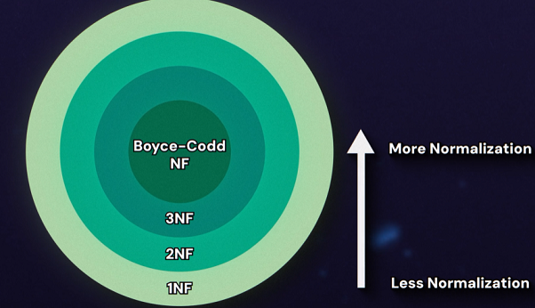

#### 1NF

First Normal Form has two rules:

1. **Every row must have a unique primary key**
2. **There can be no nested values**

The first rule fixes duplicate rows by adding a unique id to each row. Even when the data appears duplicated, each row remains distinct because of its id. The second rule is about atomicity—each field holds the smallest meaningful piece of data. Every table cell must contain a single value (no lists, no sets, no nested data). For example, a `Name` field is not atomic if it stores both a first name and a last name, since these can be separated into individual columns such as `FirstName` and `LastName`.

A good example of 1NF can be seen with employee data. Imagine a system where employees can have multiple account numbers. The table might store these numbers across separate columns such as `AccountNumber1`, `AccountNumber2`, and so on, or combine them into a single column. First Normal Form resolves this by removing multi-valued fields and storing each value in its own row, usually by moving them into a separate related table.

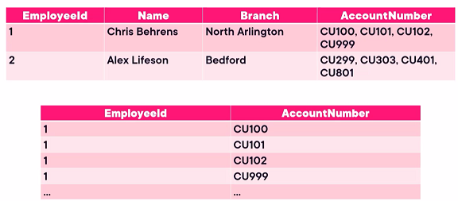

#### 2NF

2NF builds directly on 1NF, but it adds one very specific rule:

1. **The table must already be in First Normal Form**
2. **All columns that are not part of the primary key must be dependent on the entire primary key, not just a part of it**

The new rule only matters when your table has a composite primary key (a primary key that is a unique combination of multiple columns). This means that 2NF addresses partial dependencies, and partial dependencies can only exist when the primary key consists of more than one column. With a single-column primary key, a column either depends on that key or it doesn’t; it cannot depend on part of it. So the specific 2NF violation cannot occur.

Let’s demonstrate 2NF with a concrete example. Imagine a system that tracks which students are enrolled in which courses. For each enrollment, the system stores the student’s name, the course’s name, and the grade they received. Each row is uniquely identified by a composite primary key consisting of `StudentID` and `CourseID`.


* `Grade` depends on both `StudentID` and `CourseID` → OK
* `StudentName` depends only on `StudentID` → ❌ partial dependency<br>
  A student’s name is repeated for every course they take.
* `CourseName` depends only on `CourseID` → ❌ partial dependency<br>
  A course’s name is repeated for every student enrolled.

**To comply with 2NF, we split the table so that each non-key attribute resides in the table where it is fully dependent on the primary key.**

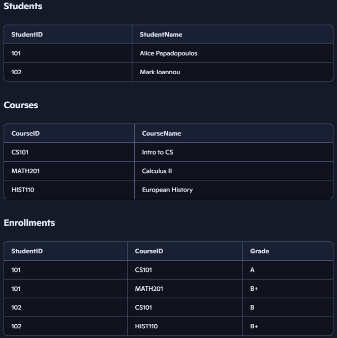

#### 3NF

3NF builds directly on 2NF, but it adds one rule:

1. **The table must already be in Second Normal Form**
2. **There must be no transitive dependencies**

A transitive dependency happens when a non‑key column depends on **another non‑key column** instead of depending only on the primary key. This feels similar to 2NF, but it applies even when the primary key is a single column.

Let's look at an example where 3NF is violated.

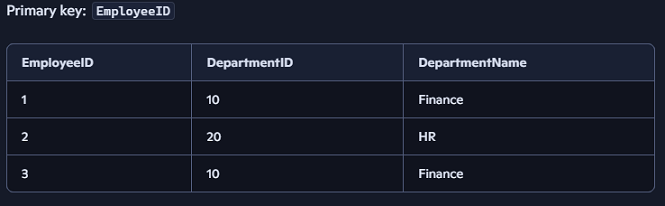

* `DepartmentID` depends on the `EmployeeID` which is the primary key → OK
* `DepartmentName` depends on `DepartmentID` which is not the primary key → ❌ transitive dependency

**To bring the table into 3NF, we split it so that every non‑key column depends directly on the primary key and not on any other non‑key column.**

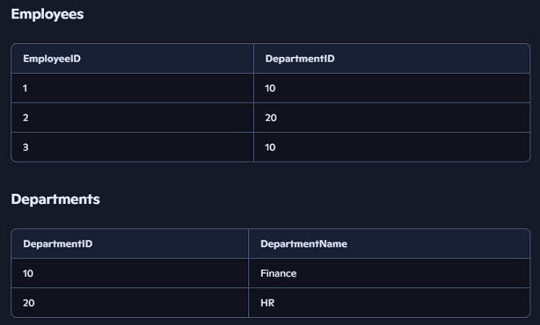

#### BCNF

There is still a way for redundant data to appear in tables even if they follow Third Normal Form (3NF). This happens when a column that is not a key determines another column. When this occurs, the same information must be repeated in multiple rows. BCNF removes this problem.

A table is in BCNF if:
1. **The table is already in Third Normal Form**
2. **Every determinant is a candidate key**

A determinant is a column (or set of columns) whose value determines another column. A candidate key uniquely identifies a row, just like a primary key, but it is not necessarily chosen as the table’s primary identifier. Every primary key is a candidate key, but a table may have more than one candidate key.

Let's compare a table that satisfies BCNF with one that violates it.

<h3>✅ Table that satisfies BCNF</h3>

In a `Student` table with columns (`StudentID`, `Email`, `Name`):
- `StudentID` uniquely identifies a row (a student)
- `Email` also uniquely identifies a row

So `StudentID` and `Email` are both candidate keys. Nothing depends on `Name`, so the table satisfies BCNF.

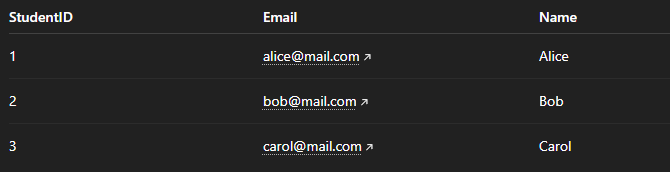

<h3>❌ Table that violates BCNF</h3>

In an `Employee` table with columns (`EmployeeID`, `Department`, `Manager`):
- `EmployeeID` uniquely identifies a row (an employee)
- Each `Department` has exactly one `Manager` 

The problem is that `Department` determines `Manager`, but `Department` is not a candidate key. `Department` cannot uniquely identify a row in this table because multiple employees can belong to the same department. This means the manager information is repeated for every employee in the same department, which violates BCNF because a determinant is not a candidate key.

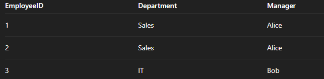

## OLAP

OLAP systems are **optimized for read operations** and built to help business users extract insights from data. Their **primary users are analysts**,  rather than everyday operational staff as in OLTP environments.
The core purpose of OLAP is to transform detailed transactional data into meaningful information by shifting the focus from individual transactions to aggregated data.

OLAP workflows typically begin with data collected from OLTP sources and ingested into a central repository, such as a data warehouse or lakehouse, where it is transformed, cleaned, and consolidated into a single source of truth. On top of this authoritative dataset, an analytical layer is introduced to support fast, multidimensional querying. 

- In traditional architectures, this layer is implemented as a dedicated OLAP database built from the warehouse and stored in the form of [OLAP cubes](https://www.keboola.com/blog/olap-cubes).
- In **modern architectures**, the analytical layer is provided by columnar, SQL‑based analytical engines (e.g., Snowflake, DuckDB, BigQuery, Azure Synapse SQL) that do not require cubes and instead query the warehouse or lakehouse directly.

Regardless of whether the analytical layer is implemented using OLAP cubes or modern SQL-based analytical engines, data is commonly organized using **dimensional modeling** — a design approach that structures data into **fact tables** (quantitative measures) and **dimension tables** (descriptive attributes). This modeling technique makes large volumes of data easier to explore by enabling analysts to aggregate, filter, and analyze information across multiple perspectives with minimal query complexity.

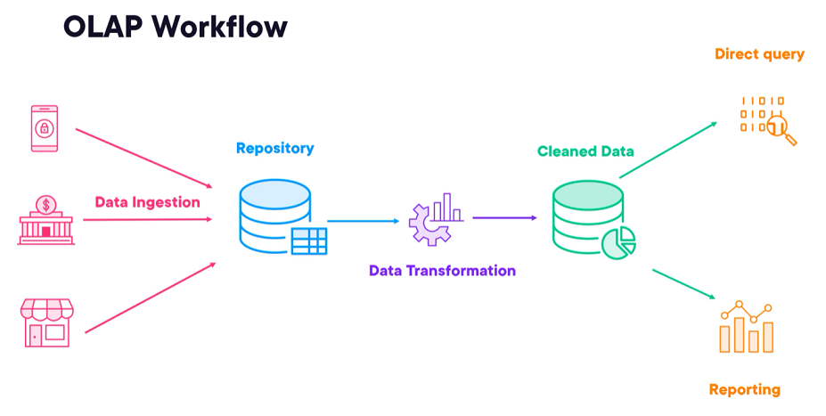

### Dimensional Modelling

The main goal of dimensional modeling is to improve data retrieval, optimizing it for `SELECT` operations. Data is organized into fact and dimension tables: facts capture what happened, while dimensions describe the circumstances around it.
- **Facts:** store the measurements of a business process—values you can count, sum, or average. Examples include sale quantity, price, revenue, or units sold. They answer questions like “How much?” or “How many?”.<br>
  
  **How to identify a fact** 
  - It is measurable or numeric.
  - It records an event or business process.
  - It can be analyzed across dimensions.
  
- **Dimensions:** give context by answering when, where, who, and what. Examples include the date of the sale, the store, the customer, or the product. They provide the attributes analysts use to filter, group, and explore the facts. <br>
  
  **How to identify a dimension**
  - It answers questions like “What?”, “Who?”, “Where?”, or “When?” about a fact.
  - It contains descriptive or categorical attributes (names, types, IDs, categories).
  - It is used to segment, group, or filter facts in analysis or reporting.

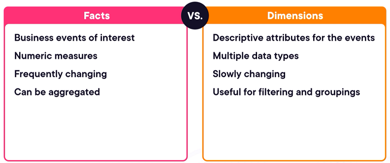
 
#### Grain

Grain, or granularity, represents the level of detail each row in a fact table captures. 

`Grain = what one row in your fact table represents`

Grain can be coarse or fine:
- **Coarse grain**: sales per year<br> Each row represents sales for a single year.
- **Fine grain**: sales per minute<br> Each row represents sales for a single minute.

Both show the same type of measurement at different levels of aggregation. Moving from year → month → day → minute increases the level of detail, resulting in a finer grain. To **visualize grain**, think of zoom levels on a map:
- Country level → monthly totals
- City level → daily totals
- Street level → transaction grain
  
The data exists at different zoom levels. Grain is the zoom level you choose.

##### <h4>Choosing Grain</h4>

Grain ultimately determines how powerful or limited your analytics will be. It also dictates what questions analysts can realistically answer, since the grain controls the types of queries the data can support. Once the grain is defined, everything else — measures, dimensions, table size, and the kinds of analysis you can support — flows directly from that choice. Getting the grain right early is essential; changing it later effectively requires redesigning and reloading the entire fact table.

**Choose the right grain by asking:**

- What questions do analysts need to answer?
- What is the natural business event?  
- How much detail is actually useful?
- How large can the table be?

**Simple rule**: Choose the lowest level of detail you actually need. You can always summarize later, but you can’t magically add detail you never stored. 

**🍕 A Simple Example: The Pizza Shop**

Imagine you run a pizza shop and want to store sales data. You have several choices for grain:

**Option 1**: One row per entire order
- One row = one customer’s whole order
- You know the total price and date
- You cannot see which pizzas were purchased

| order_id | customer | date       | total_price |
| -------- | -------- | ---------- | ----------- |
| 1001     | Alice    | 2026-02-16 | 25.00       |
| 1002     | Bob      | 2026-02-16 | 18.00       |


**Option 2**: One row per pizza in the order
- One row = one pizza on the order
- You can analyze which pizzas sell best
- More detail, more rows

| order_id | customer | date       | pizza      | price |
| -------- | -------- | ---------- | ---------- | ----- |
| 1001     | Alice    | 2026-02-16 | Margherita | 10.00 |
| 1001     | Alice    | 2026-02-16 | Pepperoni  | 15.00 |
| 1002     | Bob      | 2026-02-16 | Veggie     | 18.00 |


**Option 3**: One row per ingredient used
- One row = each ingredient used in each pizza
- Extremely detailed
- Very large table

| order_id | customer | date       | pizza      | ingredient | ingredient_qty |
| -------- | -------- | ---------- | ---------- | ---------- | -------------- |
| 1001     | Alice    | 2026-02-16 | Margherita | Cheese     | 100g           |
| 1001     | Alice    | 2026-02-16 | Margherita | Tomato     | 80g            |
| 1001     | Alice    | 2026-02-16 | Pepperoni  | Cheese     | 100g           |
| 1001     | Alice    | 2026-02-16 | Pepperoni  | Pepperoni  | 50g            |
| 1002     | Bob      | 2026-02-16 | Veggie     | Cheese     | 100g           |
| 1002     | Bob      | 2026-02-16 | Veggie     | Peppers    | 50g            |

Choosing the grain is not about how many dimension fields a row contains, but about the level of aggregation each row represents; dimensions naturally follow from that decision — not the other way around. **Grain defines the level of measurement**, while **dimensions provide the context needed to interpret that measurement**. That’s why, in modeling, we define grain before adding measures or columns.


#### Designing Fact Tables

A fact table represents a measurable business process:
* Has a primary key (often a surrogate key or a composite of foreign keys) to uniquely identify each row.
* Stores numeric measures (e.g., amount, quantity, duration) consistent with its grain.
* Contains foreign keys—typically surrogate keys—linking to dimension tables.
* May store source system natural keys to trace records back to the originating operational system.

Fact tables group measurements that share the same grain. A new fact table is created when the level of detail or the business event changes, not when a new measure is added.

##### <h4>Signs of a Poorly Designed Fact Table</h4>

* **Duplicate rows** due to missing or improper primary key
* **Foreign keys missing or inconsistent**, making joins to dimensions unreliable
* **Measures not aligned with the grain**, e.g., storing totals alongside line-level details
* **Overloaded with too many unrelated measures**, better split into multiple fact tables
* **No traceability**, lacking source system keys for auditing or reconciliation
  
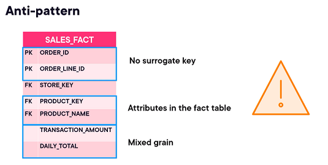

#### Designing Dimensions

Dimensions are the context of analysis:
- Have a surrogate key (primary key, warehouse-generated)
- May store a natural key from the source system
- Hold descriptive attributes (name, category, status, etc.)
- May contain hierarchical attributes (City → State → Country)
- May contain date-related attributes (Year, Quarter, Month, DayOfWeek — especially in a Date dimension)
- May include indicator/flag attributes (IsMember, IsActive, IsCurrent)
- May include numeric descriptors (e.g., unit_price, square_footage — if they describe the entity rather than represent measurable events)

##### <h4>Hierarchies Enable Drill-down</h4>

Hierarchical attributes like City, State, and Country enable drill-down analysis, which is the ability to navigate data from higher levels of aggregation to more detailed levels (Country → State), allowing analysts to move from summarized views (e.g., total sales by Country) to progressively finer granularity (State, then City) in order to understand patterns, identify trends, or investigate anomalies.

```sql
-- Total sales by State within each Country
SELECT country, state, SUM(sale_amount) AS total_sales
FROM fact_sales f
JOIN dim_location l ON f.location_key = l.location_key
GROUP BY country, state;
```

##### <h4>Date and Time Dimensions</h4>

In a data warehouse, **Date and Time dimensions are usually fully built in advance**, rather than being created dynamically as data arrives. During the data loading process (ETL), each record in the fact table is assigned a `date_key` that corresponds to a row in the Date dimension. This key is either derived directly from the source date (for example, `YYYYMMDD`) or obtained by looking up the matching date in the Date dimension. The fact table then stores only the `date_key`, and queries later join the fact table to the Date dimension using this key to retrieve calendar attributes such as day, month, or year.

`dim_date`
| date_key | full_date  | month | year |
| -------- | ---------- | ----- | ---- |
| 20260218 | 2026-02-18 | 2     | 2026 |
| 20260219 | 2026-02-19 | 2     | 2026 |

`fact_sales`
| date_key | quantity |
| -------- | -------- |
| 20260218 | 5        |
| 20260219 | 3        |

The join is performed on `date_key`:<br>
`fact_sales.date_key = dim_date.date_key`

The Date/Time dimension enables **calendar-based analysis**. Dates are broken into components such as year, month, and day, while also including business-specific attributes like `FISCAL_YEAR` and flags such as `IS_WEEKEND` or `IS_BUSINESS_HOUR`. A similar approach is used for Time dimensions, which break down hours, minutes, and seconds and can include business-related flags.

Implementing Date dimensions is done by pre-populating the dimension with several years worth of dates (past, current, and future).<br>
The Time dimension is usually pre-populated depending on the grain:
- 24 rows for hour grain
- 1440 rows for minute grain
- 86400 rows for second grain

##### <h4>Degenerate Dimensions</h4>

A degenerate dimension is a dimension key stored only in the fact table with no separate dimension table, usually used for identifiers like order numbers or invoice IDs that don’t have additional descriptive attributes.

##### <h4>Signs of a Poorly Designed Dimension</h4>

* **No surrogate key** – breaks Slowly Changing Dimension handling; ties warehouse to source-system changes.
* **Too normalized** – Dimensions should be denormalized. Foreign keys to other lookup tables add unnecessary joins.
* **Nullable columns** – lead to broken lookups and nulls in fact tables. Replace null with well-documented dummy values.
* **Attributes that don’t belong together** – mix of unrelated concepts signals need for mini-dims or refactoring.
* **Unclear or inconsistent naming** – makes the dimension hard to understand and use.

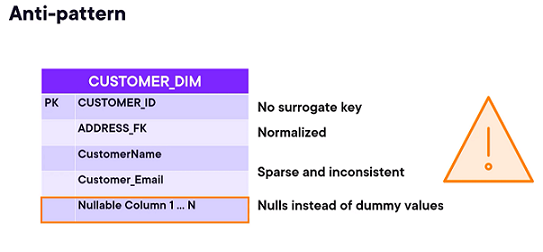

#### Star Schema Relationships

In a star schema, fact tables usually have a **many-to-one relationship** with each dimension. This means that many rows in the fact table correspond to a single row in the dimension table. Each fact row stores foreign keys that point to dimension records, allowing multiple facts to share the same dimension attributes. 

```
                 dim_product                                      dim_date
           +----------------+----------------+-------------+   +----------------+----------------+-------------+
           | product_key(PK)| product_name   | category    |   | date_key (PK)  | full_date      | day_of_week |
           +----------------+----------------+-------------+   +----------------+----------------+-------------+
           | 101            | Widget A       | Widgets     |   | 20260218       | 2026-02-18     | Tuesday     |
           | 102            | Widget B       | Widgets     |   | 20260219       | 2026-02-19     | Wednesday   |
           +----------------+----------------+-------------+   +----------------+----------------+-------------+
                    ^                                                      ^
                    |                                                      |
                    |                                                      |
                    |                                                      |
                    |                                                      |
               +---------------------------------------------------------------+
               |                         fact_sales                            |
               +---------------------------------------------------------------+
               | date_key (FK) | product_key (FK) | quantity                   |
               +---------------------------------------------------------------+
               | 20260218      | 101              | 5                          |
               | 20260218      | 101              | 2                          |
               | 20260218      | 102              | 3                          |
               | 20260219      | 101              | 4                          |
               +---------------------------------------------------------------+

```

There are, however, scenarios wheere a star schema need to handle many-to-many relationships, and this require a junction table connecting the fact to the dimension.

#### Naming Conventions

- Fact tables store measures and foreign keys. Prefix with `fact_` (e.g., `fact_sales`) or use a clear descriptive name (`sales`, `orders`). 
- Dimension tables store descriptive attributes for an entity. Prefix with `dim_` (e.g., `dim_product`, `dim_customer`) or use a clear name (`product`, `customer`).
- Consistency matters: Use the chosen convention consistently to make the schema easy to read and navigate.

### Denormalization

Normalization is a data‑modeling technique that can be applied to any relational system, but in practice it is most closely associated with OLTP. OLTP workloads benefit from normalization because it reduces redundancy, enforces data integrity, and supports fast, concurrent writes. In OLAP systems, normalization is used much more selectively: highly normalized structures introduce additional joins, which slow down large‑scale analytical queries. For this reason, OLAP environments favor read‑optimized modeling patterns such as star schemas (lightly denormalized), snowflake schemas (normalized dimensions), and fully denormalized wide tables common in modern columnar warehouses.

Two reasons to denormalize:
1. **Reduce I/O time**
2. Reduce the complexity of queries 

Denormalization often combines multiple normalized tables into a single table or view, so queries can read data directly without many joins. Repeating dimension attributes across rows is fine, but each fact row must represent exactly one event or measurement at its defined grain — duplicate rows will inflate totals and produce incorrect analytics. Dimension duplication is expected and safe, fact duplication is a logic error.

**Denormalize a dimension attribute when:**
- The attribute is mainly used for filtering or grouping<br>
  The attribute frequently appears in WHERE clauses or GROUP BY operations, so keeping it in the same table reduces query complexity and improves performance.
- The hierarchy is stable (City → State → Country)<br>
  Relationships between hierarchy levels rarely change (for example, a city rarely moves to another state). Storing all levels together avoids unnecessary joins while not creating significant maintenance effort, since updates are uncommon.
- The data is relatively small and changes infrequently<br>
  Dimension tables are typically much smaller than fact tables. If attribute values change rarely, duplicating them across rows does not create meaningful storage or maintenance overhead.
- Redundancy does not create conflicting meanings<br>
  Repeating the attribute across rows does not risk inconsistent values or different interpretations of the same business concept.

**Normalize a dimension attribute when:**
- The attribute changes independently and frequently<br>
  The attribute can change without the rest of the dimension changing (for example, supplier contact details changing independently of products). If you denormalize it, the same value is stored in many rows. When it changes, every row containing that value must be updated to keep data consistent. This increases the risk that some rows remain outdated due to partial loads, historical records, or ETL errors, leading to inconsistent reporting and making change management more complex, especially when historical tracking is required.

- The attribute has many-to-many relationships<br>
  A single attribute value relates to multiple entities, requiring a junction table to correctly represent relationships without duplication.

- The structure is large and highly reusable across multiple dimensions<br>
  The same dataset is used by multiple subject areas or dimensions. Keeping it separate avoids duplication and centralizes maintenance. For example, geography data might be used by both a Customer dimension and a Store dimension. If you denormalize it into each of these dimensions, you duplicate the entire geography structure multiple times which complicates updates and risks data integrity. If, however, geography is stored once in a dedicated Geography dimension, all other dimensions reference it.

- Redundancy would cause update inconsistencies<br>
  Storing the same attribute in multiple locations increases the chance that some rows are updated while others are not, leading to conflicting values and inaccurate reporting.


https://www.thoughtspot.com/data-trends/data-modeling/dimensional-data-modeling