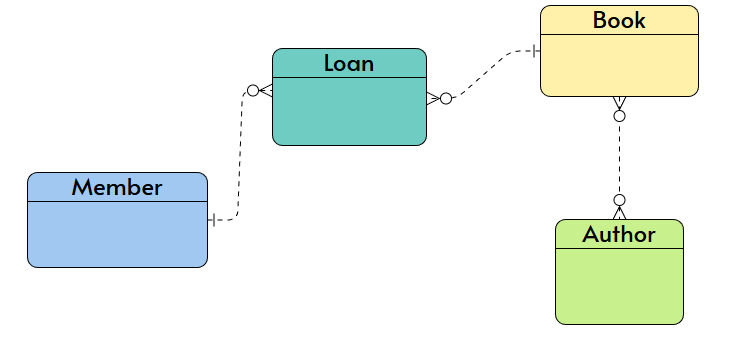
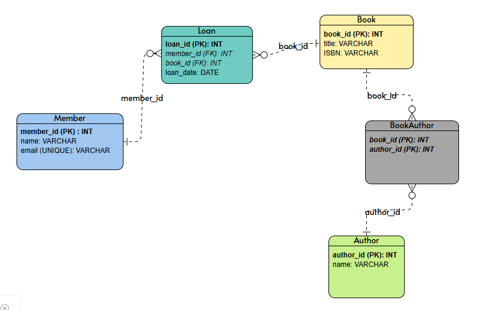

<h1>Welcome to my SQL Guide</h1>

Choose your topic from the list below

- [SQL Server in Docker](#sql-server-in-docker)
  - [Volumes Required](#volumes-required)
    - [Managing Permissions](#managing-permissions)
  - [Containerize SQL Server](#containerize-sql-server)
    - [Authentication](#authentication)
    - [Run](#run)
    - [Run with --env-file](#run-with---env-file)
  - [Querying](#querying)
    - [Interactive Terminal](#interactive-terminal)
    - [Command Line Queries](#command-line-queries)
    - [Script Files](#script-files)
  - [Security](#security)
    - [Admin User](#admin-user)
- [Migrations: Database Reproducibility](#migrations-database-reproducibility)
  - [Designing Safe Migrations](#designing-safe-migrations)
    - [Multi-phase Deployment](#multi-phase-deployment)
    - [Reversible Migrations](#reversible-migrations)
  - [Migration Tools](#migration-tools)
    - [High-level Workflow](#high-level-workflow)
    - [Flyway](#flyway)
      - [Common Workflows with Flyway](#common-workflows-with-flyway)
      - [Installation](#installation)
      - [Setup](#setup)
      - [Down Migrations](#down-migrations)
      - [Flyway with SQL Server and Docker](#flyway-with-sql-server-and-docker)
      - [ERROR: Validate failed](#error-validate-failed)
  - [Migrate Everything?](#migrate-everything)
- [Backups: Database Recovery](#backups-database-recovery)
  - [Backups for Dockerized SQL Server](#backups-for-dockerized-sql-server)
    - [Create a Backup](#create-a-backup)
    - [Store Backup to a Volume](#store-backup-to-a-volume)
- [Constraints](#constraints)
  - [Primary \& Foreign Keys](#primary--foreign-keys)
- [Table Relationships](#table-relationships)
- [Normalization](#normalization)
  - [1NF](#1nf)
  - [2NF](#2nf)
  - [3NF](#3nf)
  - [BCNF](#bcnf)
  - [Denormalization](#denormalization)
- [ACID Transactions (OLTP)](#acid-transactions-oltp)
- [Data Modelling](#data-modelling)
  - [Conceptual](#conceptual)
    - [OLTP](#oltp)
    - [OLAP](#olap)
    - [Visualize (High-Level)](#visualize-high-level)
  - [Logical](#logical)
    - [OLTP Workflow](#oltp-workflow)
    - [OLAP Workflow](#olap-workflow)
      - [The Holy... Grain](#the-holy-grain)
    - [Visualize (Low-Level)](#visualize-low-level)
    - [Documentation](#documentation)

---

# SQL Server in Docker

## Volumes Required

While a database can run inside a container, its data must exist outside the container’s lifecycle, such as in volumes. <br>
Three things to persist in a SQL Server container:

1. Data
2. Logs (SQL Server Logs, not database transaction logs which are stored alongside the data)
3. Secrets

Each corresponds to a separate volume - a directory on the host mapped into the container.

### Managing Permissions

[SQL Server images](https://mcr.microsoft.com/en-us/catalog?search=sql%20server) run on Linux-based containers. This means that to persist data, the container’s Linux file system must be mapped to the host file system. It’s best to map a Linux container file system to a Linux host file system. On Windows, this requires using WSL, since mapping a Linux container directly to the Windows file system can lead to performance issues. Another option is to use [docker-managed volumes](https://www.youtube.com/watch?v=p2PH_YPCsis) which automatically stores data in a Linux-native filesystem. Regardless of the approach, SQL Server containers require that the container’s internal user (i.e., `mssql`) has write access to the mounted directories.

SQL Server images on Linux do not run as root by default. Although Docker can mount volumes normally, the `mssql` user inside the container must have ownership of — or write access to — the mounted volumes. If it doesn’t, the SQL Server boot process cannot write system database files, causing the container to exit with an “Access is denied” error. Since the container runs as UID 10001, any mounted volume must either be **owned by that user** or have **write permissions granted** so that `mssql` can access it. While adjusting write permissions with `chmod` is technically sufficient, particularly for development or testing setups, ownership is safer and ensures that only the `mssql` user inside the container can write to the directories. Therefore, the recommended approach is to set `mssql` as the owner of the volume before starting the container.

Create the volume directories at a host path of your choice: 
```bash
mkdir -p <host_sqlserver_volume_path>/{data,log,secrets}
```

You then have two options:

1. Production-safe 
   
   Set ownership on that host path for the SQL Server container user (UID 10001) and restrict permissions to owner and group: 

   ```bash
   # Change owner and group to mssql
   sudo chown -R 10001:10001 <host_sqlserver_volume_path>

   # Restrict permissions to owner (mssql) and group (still mssql)
   sudo chmod -R 770 <host_sqlserver_volume_path>
   ```
   * Only the mssql user inside the container can write
   * Recommended for production and long-term use
  
2. Development-only
   
   Set ownership to `mssql` and grant full write permissions to everyone (revert before going live):

    ```bash
    sudo chown -R 10001:10001 <host_sqlserver_volume_path>
    sudo chmod -R 777 <host_sqlserver_volume_path>
    ```
    * Any user on the host or process can write to the directories
    * Works for quick experiments or testing, but not safe for production

## Containerize SQL Server

### Authentication

There are two primary ways of authenticating SQL Server
1. SQL Server Authentication: uses a SQL Server–specific username and password (e.g., `sa` or any user you create).
2. Windows Authentication: uses your Windows (or Active Directory) credentials - no separate username/password needed in SQL Server itself.

When running SQL Server in containers, SQL Server Authentication is recommended. Windows Authentication is mostly only practical if your container runs on Windows Server containers and is joined to a domain.

### Run

For SQL Server, `/var/opt/mssql/` is where database files live inside the container, so this is where we will be mounting volumes. Ensure the SA password meets SQL Server requirements — at least 8 characters including uppercase, lowercase, digits, and special characters — otherwise the container may exit with the error: Unable to set system administrator password.

```bash
docker pull mcr.microsoft.com/mssql/server:<tag>

docker run -d \
  --name <container_name> \
  -e ACCEPT_EULA=Y \
  -e MSSQL_SA_PASSWORD='<password>' \
  -p <host_port>:1433 \
  -v <host_sqlserver_volume_path>/data:/var/opt/mssql/data \
  -v <host_sqlserver_volume_path>/log:/var/opt/mssql/log \
  -v <host_sqlserver_volume_path>/secrets:/var/opt/mssql/secrets \
  mcr.microsoft.com/mssql/server:<tag>

# Confirm setup was successfull
docker logs <container_name>
```
* `-e`: Passes [environment variables](https://learn.microsoft.com/en-us/sql/linux/sql-server-linux-configure-environment-variables?view=sql-server-ver17) into the container at runtime. SQL Server uses these to configure itself on startup, such as accepting the EULA (end-user license agreement) and setting the `sa` (system administrator) password. 
* `-v`: Mounts a directory from the host into the container.
* `-p <host_port>:1433`: exposes the container’s SQL Server to your host, allowing you to connect to it from SSMS or any SQL client on your machine. 

### Run with --env-file

You can create a simple `.env` file for Docker to store environment variables like the SA password, EULA acceptance, and any other configuration. Docker will automatically read all the variables from `.env` file and sensitive info (like SA password) will be kept out of your command history.

1. Create `.env` file (e.g. `mssql.env`)
   
```bash
touch mssql.env
```

2. Add environment variables inside
   
```bash
# Accept SQL Server EULA
ACCEPT_EULA=Y

# SA password 
MSSQL_SA_PASSWORD=<password>
```
Tip: Make sure there are no spaces around `=` and no quotes around the values.

3. Use the `.env` file when running the container
   
```bash
docker run -d \
--name <container_name> \
--env-file <path_to_env_file>/mssql.env \
-p <host_port>:1433 \
-v <host_sqlserver_volume_path>/data:/var/opt/mssql/data \
-v <host_sqlserver_volume_path>/log:/var/opt/mssql/log \
-v <host_sqlserver_volume_path>/secrets:/var/opt/mssql/secrets \
mcr.microsoft.com/mssql/server:<tag>
```

## Querying

Microsoft provides a command-line tool called `sqlcmd` for interacting with SQL Server databases, whether on the host or inside a running container. Note that not all SQL Server images include this tool by default. To use it inside a container, you may need to switch to the root user (since the container runs as `mssql` and lacks permission) and install the `mssql-tools` package.

```bash
# Run container as root
docker exec -it --user root <container_name> bash

# Install mssql-tools
apt-get update
apt-get install -y mssql-tools unixodbc-dev
```

Once `mssql-tools` is installed, `sqlcmd` will be available at `/opt/mssql-tools/bin/sqlcmd`, allowing us to access the database in several ways

### Interactive Terminal

```bash
docker exec -it <container_name> \
/opt/mssql-tools/bin/sqlcmd \
-S <server> \
-U <username> \
-P '<password>' \
-C
```
* `docker exec -it` → run interactively inside the container
* `/opt/mssql-tools/bin/sqlcmd` → path to the tool inside SQL Server image
* `-S` → server name or IP (for local Docker: `localhost,1433`)
* `-U` → SQL login (`sa` by default)
* `-P` → password
* `-C` → Trusts the self-signed SSL certificate (for a local docker container without TLS, you can omit this).


Then you can type queries, ending each with `GO`:
```sql
CREATE DATABASE TestDB;
GO
SELECT name FROM sys.databases;
GO
```
* `GO` → Tells SQL Server to execute the command.

When finished, exit the interactive session with:
```sql
QUIT
```
    
### Command Line Queries

```bash
docker exec <container_name> \
/opt/mssql-tools/bin/sqlcmd \
-S <server> -U <username> -P '<password>' -C \
-Q "<query_code>;"
```
* `-Q` → runs the query and exits

### Script Files

```bash
docker exec <container_name> \
/opt/mssql-tools/bin/sqlcmd \
-S <server> -U <username> -P '<password>' -C \
-i /path/to/script.sql
```
* `-i` → runs queries from `script.sql`

The `-i /path/to/script.sql` expects the script to exist inside the container. If it’s on the host, you must mount the directory as a volume when starting the container.

## Security

### Admin User

The `sa` user is a master key for SQL Server with unrestricted access. While convenient, it’s a major security risk: it has full system control, is a well-known attack target, and is frequently targeted by automated brute-force attempts. It's best to create a new admin user and disable `sa`.

```bash
# Run sqlcmd in interactive mode
docker exec -it <container_name> \
/opt/mssql-tools/bin/sqlcmd \
-S <server> \
-U <username> \
-P '<password>' \

# Create a new admin login
CREATE LOGIN <admin_user_name>
WITH PASSWORD = '<password>';
GO

# Grant sysadmin priviledges
ALTER SERVER ROLE sysadmin 
ADD MEMBER <admin_user_name>;
GO

# Ensure new admin works
SELECT name FROM sys.sql_logins 
WHERE name = '<admin_user_name>';
GO

# Disable sa
ALTER LOGIN sa DISABLE;
GO
```

# Migrations: Database Reproducibility

Database reproducibility refers to the ability to reliably recreate a database environment — including its schema, data, and configuration — so that it behaves the same way across different systems, times, or stages of development. This is typically achieved using [migrations](https://en.wikipedia.org/wiki/Schema_migration). A database migration is a change to the structure of a relational database. You can think of it like a commit in Git, but for your database schema. Every migration records how the structure of your data evolves over time.

* 🚫 The Wrong Way to Migrate

    Making schema changes directly on a live database is risky. If you manually modify the production database — for example by running `ALTER TABLE` commands — those changes exist only in that database. There’s no reliable record of what changed, no easy way to apply the same changes to development or staging databases, and no clear way to undo them if something goes wrong.

* ✅ The Right Way to Migrate

    Instead, describe every schema change in a migration file: a small, explicit script that says how the database structure should change. These files are saved with your code and applied in order to each environment (development, staging, production). By doing this, the database schema evolves in a controlled, repeatable way. Everyone runs the same steps, the schema stays aligned with the code, and the full history of changes is preserved — much like version control, but for the database structure.

**Why not just use Git?** 

Git alone can’t manage a database’s state. It only tracks files, so it has no awareness of which schema changes have actually been applied. Migration tools, by contrast, aren’t meant to track SQL code itself - Git already does that. Their purpose is to track the database state: which schema changes (tables, columns, constraints, defaults, and so on) have been applied, in what order, and whether they can be rolled back. Git manages the files; migrations manage the database.

Nevertheless, Git is key for migrations because it versions the migration files alongside the application code. When we create a migration file for a specific application version, Git commits it alongside the code. Pushing these files to a remote repository ensures the deployment process can access them, keeping the database schema in sync with the deployed code.

## Designing Safe Migrations

Our system should automatically run database migrations whenever we deploy new code (e.g., through a CI/CD pipeline). This ensures that the database schema is always in sync with the code. It also makes it easy to set up new databases in any environment:
* If we need a fresh copy of the database for testing or staging, running all migrations in order will recreate the schema exactly as in production.
* If we want to set up a local development environment, running the migrations will build the correct database structure without manually creating tables or columns.

Good migrations are small, incremental and ideally reversible changes to a database. **A good migration considers two key things:**
1. **The old**, currently running version of the code 
2. **The new** version of the code that will run after the migration is complete

### Multi-phase Deployment

If you apply a database migration that doesn’t match the code currently running in production, the app may break. Similarly, if you deploy new code that expects a different database schema than what’s currently in place, the app can also fail. The solution to the schema-code mismatch problem is a multi-phase deployment:
1. **Expand phase** – Apply changes that are safe with both old and new code (e.g., adding a new column without removing the old one).
2. **Deploy new code** – Release the new version of the application while the database has been safely expanded, ensuring the schema supports both the old and new code during the migration.
3. **Contract phase** – Once the new code is running everywhere, run a clean-up migration to remove or modify old structures that are no longer needed.

**Updating existing columns** requires extra caution. Avoid directly renaming or modifying a column. Instead, do another multi-phase deployment:
1. Create a new column
2. Copy data from the old column into the new one
3. Deploy code that uses the new column (while the old column still exists for the old, currently running version of the app to use).
4. Recopy data from the old column to the new column to catch any changes made between the first copy and the deployment.
5. Run a migration to remove the old column.

**Last resort:** If multi-phase deployment isn’t feasible, schedule downtime so users are aware that the app will be temporarily unavailable while the changes are applied safely.

### Reversible Migrations

To manage migrations, we use a simple system based on **up** and **down** directions.
* The **up** migration applies changes to move your schema forward.
  
    ```sql
    -- Migrate up
    ALTER TABLE transactions
    ADD COLUMN transaction_type TEXT;
    ```

* The **down** migration rolls those changes back to the previous state. 
  
    ```sql
    -- Migrate down
    ALTER TABLE transactions
    DROP COLUMN transaction_type;
    ```

## Migration Tools

As we've seen in the [reversible migrations](#reversible-migrations) section, we create an 'up migration' to apply a change. If we later need to revert it, we create a separate 'down migration'. Each migration is written in its own file, essentially a script containing SQL code. A migration tool processes these files, applying or reverting the schema based on the command provided.

| Tool    | Language(s)                  | Notes                                                                 |
|---------|-----------------------------|----------------------------------------------------------------------|
| [Flyway](https://github.com/flyway/flyway)  | Java (also language-agnostic) | Executes plain SQL scripts; cloud-ready; CI/CD-friendly |
| [Alembic](https://alembic.sqlalchemy.org/en/latest/index.html) | Python                      | Designed for SQLAlchemy; supports migrations written in Python or SQL |
| [Goose](https://pressly.github.io/goose/?utm_source=chatgpt.com)   | Go                          | Native Go tool; primarily SQL-based but also allows Go functions for migrations |

### High-level Workflow

*Each tool’s workflow varies - some don’t support down migrations, and rollbacks are handled differently - but the general procedure is:*

1. Write migration files.
   
   * `001_add_columns_to_transactions.up.sql`
   * `001_add_columns_to_transactions.down.sql`

    The `.up.sql` file defines the changes to apply to the database, while the `.down.sql` file defines how to revert those changes.

2. Apply them using a CLI:
   
    ```bash
    migrate up
    ```

    This command tells the migration tool to:
    * Look at all migration files in order (e.g. `001_*.up.sql`)
    * Check its migration history table in the database
    * Find which migrations have not been applied yet
    * Execute the corresponding `.up.sql` files against the database, in order
    * Record each successful migration in the history table so it won’t run again

    In effect, this brings the database schema up to the latest version. If we were to `migrate down`, the procedure would essentially be the same, but in reverse.

### Flyway

Flyway executes migration files exactly once and in order. It works alongside any programming language — your program doesn’t need to communicate with Flyway directly. Flyway manages the database migrations, and your program simply connects to the already-migrated database.

#### Common Workflows with Flyway

* Run Flyway in CI/CD before starting the application
* Run in Docker alongside the application (Flyway container + app container)
* Run as a startup step (shell script → Flyway → application)

#### Installation

There are two main options for using Flyway:

1. Local: [Download flyway from Redgate](https://www.red-gate.com/products/flyway/community/download/) and install on your host
2. Docker: Pull the `flyway/flyway` [official Docker image](https://hub.docker.com/r/flyway/flyway) from Docker Hub 

#### Setup

1. File naming

    After writing our migration code, Flyway expects it to be saved as a `.sql` file and named in the following format: `V<version_number>__<script_name>.sql`

    For example: `V1__create_users_table.sql`
    * `V1` → version 1 (first change)
    * `__` → double underscore separator
    * rest → description (for humans)

2. Project structure

    Flyway's config file is placed in our project's root, and migration files are usually kept in a dedicated directory (often called `db`, `migrations`, or `sql`) 

    ```bash
    project/
    ├── migrations/
    │   ├── V1__create_users_table.sql
    │   └── V2__add_email_to_users.sql
    └── flyway.conf
    ```

3. Config

    A typical Flyway configuration file (like `flyway.conf`) contains key-value pairs that tell Flyway *how to connect to the database* and *where to find migration files*. 

    ```conf
    # Database connection
    flyway.url=jdbc:<DRIVER>://<YOUR_SERVER_HOST>:<YOUR_SERVER_PORT>;databaseName=<YOUR_DATABASE_NAME>
    flyway.user=<YOUR_DB_USERNAME>
    flyway.password=<YOUR_DB_PASSWORD>

    # Where Flyway looks for migration files
    flyway.locations=filesystem:<PATH_TO_CONTAINER_MIGRATIONS_FOLDER>

    # Optional: manage a specific schema (dbo by default)
    flyway.schemas=<YOUR_SCHEMA_NAME_OR_DBO>

    # Optional: treats existing DB tables as baseline so migrations start tracking from now
    flyway.baselineOnMigrate=<true_or_false>

    # Optional: file naming convention (default is V<version>__<description>.sql)
    # flyway.sqlMigrationPrefix=V
    # flyway.sqlMigrationSeparator=__
    # flyway.sqlMigrationSuffix=.sql
    ```

#### Down Migrations

[Flyway's free edition](https://documentation.red-gate.com/flyway/deploying-database-changes-using-flyway/deployment-approaches-with-flyway/migrations-based-approach) is primarily forward-migration oriented. It does not have built-in undo migrations; you have to manually create them and apply them as normal migrations.

```bash
project/
└─ migrations/
   ├─ V1__create_users_table.sql
   ├─ V2__add_email_column.sql
   └─ V3__remove_email_column.sql   <-- our "down" migration
```

Essentially, “down” is just another forward migration moving the schema to a previous state. After running, Flyway applies V1, V2, then V3. V3 effectively rolls back the email column addition.

#### Flyway with SQL Server and Docker

Working with Flyway and SQL Server usually involves **two separate containers**
1. The SQL Server container is **stateful** - a long-running container that persists database data by writing to a volume
2. The Flyway container is **stateless** — a temporary container that reads migration scripts from a mounted volume, applies them, and then exits

You don’t bake migrations into the SQL Server container; instead, Flyway connects to the running SQL Server container via a JDBC connection to apply them. 


Assuming a *SQL Server container is already running*, you run Flyway as a one-off container that connects to it:

1. **Create a `flyway.conf` file on your host**
   
    ```conf
    flyway.url=jdbc:sqlserver://<host>:1433;databaseName=<YOUR_DATABASE_NAME>
    flyway.user=<YOUR_DB_USERNAME>
    flyway.password=<YOUR_DB_PASSWORD>
    flyway.locations=filesystem:/flyway/sql

    # Notes for `<host>`:
    # - Use `host.docker.internal` if connecting via the host (host SQL Server or container exposed to host)  
    # - Use the container name if connecting container-to-container on a custom Docker network
    ```

2. **Create a volume for migration scripts**
   
   ```bash
   mkdir migrations
   ```

3. **Run Flyway container and mount both the config file and the migrations**

    **Option A:** Run the container each time you want to migrate

    ```bash
    docker run --rm \
      -v <migrations_path>:/flyway/sql \
      -v <path_to_flyway.conf>:/flyway/conf/flyway.conf \
      flyway/flyway migrate
    ```

    **Option B:** Save as `migrate.sh` and just run `./migrate.sh` whenever you need to migrate
    ```bash
    #!/bin/bash
    docker run --rm \
      -v <migrations_path>:/flyway/sql \
      -v <path_to_flyway.conf>:/flyway/conf/flyway.conf \
      flyway/flyway migrate
      ```

    **Option C:** [Use Docker Compose](sqlserver-docker-flyway.md)

***Note:** When coordinating multiple containers, it's best to use something like Docker Compose*

#### ERROR: Validate failed

This error happens when Flyway detects that a migration you already applied has changed since it was first run. If you modify the migration script after it has already been applied, Flyway sees that the applied migration doesn’t match the local file and refuses to continue because this could break the database. 

To resolve:

1. **Revert the migration file** (ideally using version control) so it matches what was applied.
2. If the metadata table is out of sync or you intentionally want to accept the changes, run: `flyway repair`
  
    After repair, you can set a new baseline with: `flyway baseline`. This lets Flyway continue safely from the updated baseline without re-running or breaking existing migrations.

**Note:** `repair` only works safely in development. It updates Flyway’s schema history table to match the current files without changing the database, but should **never** be used in production, where migration history must remain immutable.


## Migrate Everything?

Migrations should include only SQL that changes the database’s structure or essential reference data—such as creating or altering tables, adding indexes or constraints, and inserting or updating baseline data your app depends on. Routine transactional operations, like modifying user or business data, as well as ad-hoc reporting or `SELECT` queries, do not belong in migrations. The rule of thumb is to migrate **schema and essential baseline data**, not everyday application queries.

A good set of migrations should allow you to delete your database and recreate it from scratch. If you can’t do that, it’s a sign something important was missed.

# Backups: Database Recovery

For data recovery, the most obvious solution is a backup, which preserves the actual data at a specific point in time and becomes relevant only once there is data worth protecting. When using Docker volumes, it may be tempting to think that backups are unnecessary, but you often need to restore to a point in time, not just “whatever is in the volume right now". You may then assume that going back to a previous state can be achieved using down migrations, but migrations describe structure, not data history, and therefore cannot reliably restore lost or corrupted data.

The goal of a backup is to be able to restore data to a known good state when something goes wrong.

## Backups for Dockerized SQL Server

A backup is a point-in-time snapshot of the database created with SQL Server tools or scripts (`.bak` file). It doesn’t automatically update — it only captures the state when it was created. In Docker, *backups should persist* outside the container, in a volume (which is just a directory on the host mapped into the container). The goal is to ensure the backup survives container restarts, upgrades, or deletions.

### Create a Backup 

Backups can be created using the container’s SQL Server tools .  

```bash
# Generates a .bak file for your backup
docker exec <container_name> /opt/mssql-tools/bin/sqlcmd \
-S <server> -U <username> -P "<password>" -C \
-Q "BACKUP DATABASE [<db_name>] TO DISK = N'/var/opt/mssql/data/<db_name>.bak' WITH INIT, FORMAT;"
```
* `TO DISK` specifies that the backup should be written to a file on disk.
  * Alternative: `TO TAPE` (for tape backups) or `TO URL` (for Azure blob storage).
* `N'/var/opt/mssql/data/<db_name>.bak'` specified the path and filename of the backup file.
  * `N'...'` → prefix `N` means it’s a Unicode string, which is a SQL Server convention (important if your path contains non-ASCII characters).
  * In Docker Linux containers, `/var/opt/mssql/data/` is the default data directory inside the container.
* `WITH INIT` initializes the backup file, overwriting any existing content.
  * Without `INIT`, SQL Server would append the new backup to the file (creating a backup set) instead of replacing it.
* `WITH FORMAT` formats the backup media, creating a new media header.
  * This is required if you want to completely overwrite an existing file and start fresh.
  * Often used together with `INIT` for a clean, standalone backup.


### Store Backup to a Volume

After creating the backup file, we need to get it out of the container. If you modified directory permissions during [volume setup](#managing-permissions), you may need to use `sudo` to copy the backup into the volume:

```bash
# Copy the backup out of the container and into the volume
sudo docker cp <container_name>:/var/opt/mssql/data/<db_name>.bak <host_path>/<db_name>.bak
```

*Note: The **safest approach** is to store the backup both in a volume and on external storage.*


# Constraints 

Constraints are rules applied to a table’s columns to enforce data integrity. They ensure that data meets specific conditions and prevent invalid entries. If these rules are violated, an error is raised, and the data is not entered into the database.

Constraints can be defined when **creating a table**

```sql
CREATE TABLE employees (
    id INT PRIMARY KEY,
    -- PRIMARY KEY uniquely identifies each employee

    name NVARCHAR(100) UNIQUE,
    -- UNIQUE ensures no two employees have the same name

    title NVARCHAR(100) NOT NULL,
    -- NOT NULL ensures the title cannot be empty

    salary DECIMAL,
    country NVARCHAR(100)
);
```

or added later by **altering an existing table**. In SQL Server, any constraint added with `ALTER TABLE` must have a name, and when adding a `DEFAULT`, the target column must also be specified

```sql
ALTER TABLE employees
ADD CONSTRAINT check_salary CHECK (salary >= 0);
-- CHECK ensures salary is non-negative

ALTER TABLE employees
ADD CONSTRAINT df_country DEFAULT 'Cyprus' FOR country;
-- DEFAULT provides a default value if none is given
```

**Note:** A single column can have **multiple constraints** applied at the same time (e.g., `NOT NULL`, `UNIQUE`, `CHECK`) either inline during `CREATE TABLE` or via separate `ALTER TABLE` statements.

## Primary & Foreign Keys

A key defines and protects relationships between tables. 

A `PRIMARY KEY` is a special column that uniquely identifies each record within a table. Each table can have **only one primary key**. It’s very common to name this column `id`, and it is almost always the primary key for the table. No two rows can share the same `id`. By definition, a primary key is always `NOT NULL`.

`FOREIGN KEY`s are what make relational databases relational. A foreign key is a column in one table that references the primary key of another table. This means that that *any value inserted into the foreign key column must already exist in the referenced column*. What's more, a foreign key does not automatically enforce `NOT NULL`, and it does not always have to be non-null. For example, a `books` table might allow books with unknown authors — in the example below, author_id can be `NULL`.

```sql
CREATE TABLE authors (
    id INT PRIMARY KEY
    -- PRIMARY KEY
);

CREATE TABLE books (
    id INT PRIMARY KEY,
    -- PRIMARY KEY for books

    author_id INT,
    CONSTRAINT fk_authors FOREIGN KEY (author_id) REFERENCES authors(id)
    -- FOREIGN KEY referencing authors
);
```

**Note:** In SQL Server, foreign keys can also be added after table creation using `ALTER TABLE`.


# Table Relationships

A relationship between tables assumes that one of these tables has a foreign key that references the primary key of another table. SQL describes relationships between tables in three ways:

| Relationship | Definition | Example |
|-------------------|---------------------------|---------|
| **One‑to‑One** | A one‑to‑one relationship means each record in one table matches with at most one record in another table. | Each **user** has exactly one **password**. |
| **One‑to‑Many** | A one‑to‑many relationship means one record in a table can be linked to many records in another table, but each of those records links back to only one parent. | One **customer** can place many **orders**, and each order belongs to one customer. |
| **Many‑to‑Many** | A many‑to‑many relationship means records in each table can be linked to multiple records in the other. | **Students** can enroll in many **courses**, and each course can have many students. |


- A one‑to‑one relationship often ends up represented simply as extra columns stored on the same row of a single table. For example, if each user has exactly one password, that password can be stored as an extra column (`password`) in the `Users` table rather than in a separate table.
- A one-to-many relationship is made explicit by adding a foreign key to the "many" side of the relationship. For example, in a system where one customer can place many orders, the `Orders` table includes a `customer_id` foreign key that points back to the `Customers` table.
  
  ```sql
  CREATE TABLE Customers (
      id INT IDENTITY PRIMARY KEY,
      name NVARCHAR(100) NOT NULL
  );

  CREATE TABLE Orders (
      id INT IDENTITY PRIMARY KEY,
      order_date DATE NOT NULL,
      customer_id INT NOT NULL, -- FK links Orders with Customers
      CONSTRAINT fk_orders_customer
          FOREIGN KEY (customer_id) REFERENCES Customers(id)
  );
  ```

- Many‑to‑many relationships occur via junction (joining) tables. For example, to represent the relationship between students and courses, we create a joining table called `student_courses` that stores the primary keys from both the `Students` and `Courses` tables. Then, when we want to check whether a student is enrolled in a specific course, we simply look in the joining table to see if the ids share a row.

  ```sql
  CREATE TABLE Students (
      id INT IDENTITY PRIMARY KEY,
      name NVARCHAR(100) NOT NULL
  );

  CREATE TABLE Courses (
      id INT IDENTITY PRIMARY KEY,
      title NVARCHAR(100) NOT NULL
  );

  -- Joining table
  CREATE TABLE student_courses (
      student_id INT NOT NULL,
      course_id INT NOT NULL,

      -- Composite primary key ensures each (student, course) pair appears only once
      CONSTRAINT pk_student_courses PRIMARY KEY (student_id, course_id),

      CONSTRAINT fk_student_courses_student
          FOREIGN KEY (student_id) REFERENCES Students(id),
      CONSTRAINT fk_student_courses_course
          FOREIGN KEY (course_id) REFERENCES Courses(id)
  );
  ```


# Normalization 

Database normalization is a method for structuring your database schema in a way that improves data integrity and reduces redundancy. Put simply, normalization is about shaping your tables so they contain less duplicate data and more consistent, reliable data. The goal is to store data in its simplest form without unnecessary copies, because duplicate data can lead to bugs. For example, a value might be updated in one table but not in another, resulting in an invalid database state — leaving uncertainty about which value is correct.

The more normalized a database is, the less duplicate data it contains. Normalization is commonly described through a series of normal forms, each introducing additional rules and building on the previous one:
1. First Normal Form (1NF)
2. Second Normal Form (2NF)
3. Third Normal Form (3NF)
4. Boyce–Codd Normal Form (BCNF) 
   
<br>


## 1NF

First Normal Form has two rules:

1. **Every row must have a unique primary key**
2. **There can be no nested values**

The first rule fixes duplicate rows by adding a unique id to each row. Even when the data appears duplicated, each row remains distinct because of its id. The second rule is about atomicity—each field holds the smallest meaningful piece of data. Every table cell must contain a single value (no lists, no sets, no nested data). For example, a `Name` field is not atomic if it stores both a first name and a last name, since these can be separated into individual columns such as `FirstName` and `LastName`.

A good example of 1NF can be seen with employee data. Imagine a system where employees can have multiple account numbers. The table might store these numbers across separate columns such as `AccountNumber1`, `AccountNumber2`, and so on, or combine them into a single column. First Normal Form resolves this by removing multi-valued fields and storing each value in its own row, usually by moving them into a separate related table.


## 2NF

2NF builds directly on 1NF, but it adds one very specific rule:

1. **The table must already be in First Normal Form**
2. **All columns that are not part of the primary key must be dependent on the entire primary key, not just a part of it**

The new rule only matters when your table has a composite primary key (a primary key that is a unique combination of multiple columns). This means that 2NF addresses partial dependencies, and partial dependencies can only exist when the primary key consists of more than one column. With a single-column primary key, a column either depends on that key or it doesn’t; it cannot depend on part of it. So the specific 2NF violation cannot occur.

Let’s demonstrate 2NF with a concrete example. Imagine a system that tracks which students are enrolled in which courses. For each enrollment, the system stores the student’s name, the course’s name, and the grade they received. Each row is uniquely identified by a composite primary key consisting of `StudentID` and `CourseID`.


* `Grade` depends on both `StudentID` and `CourseID` → OK
* `StudentName` depends only on `StudentID` → ❌ partial dependency<br>
  A student’s name is repeated for every course they take.
* `CourseName` depends only on `CourseID` → ❌ partial dependency<br>
  A course’s name is repeated for every student enrolled.

**To comply with 2NF, we split the table so that each non-key attribute resides in the table where it is fully dependent on the primary key.**


## 3NF

3NF builds directly on 2NF, but it adds one rule:

1. **The table must already be in Second Normal Form**
2. **There must be no transitive dependencies**

A transitive dependency happens when a non‑key column depends on **another non‑key column** instead of depending only on the primary key. This feels similar to 2NF, but it applies even when the primary key is a single column.

Let's look at an example where 3NF is violated.


* `DepartmentID` depends on the `EmployeeID` which is the primary key → OK
* `DepartmentName` depends on `DepartmentID` which is not the primary key → ❌ transitive dependency

**To bring the table into 3NF, we split it so that every non‑key column depends directly on the primary key and not on any other non‑key column.**


## BCNF

There is still a way for redundant data to appear in tables even if they follow Third Normal Form (3NF). This happens when a column that is not a key determines another column. When this occurs, the same information must be repeated in multiple rows. BCNF removes this problem.

A table is in BCNF if:
1. **The table is already in Third Normal Form**
2. **Every determinant is a candidate key**

A determinant is a column (or set of columns) whose value determines another column. A candidate key uniquely identifies a row, just like a primary key, but it is not necessarily chosen as the table’s primary identifier. Every primary key is a candidate key, but a table may have more than one candidate key.

Let's compare a table that satisfies BCNF with one that violates it.

<h3>✅ Table that satisfies BCNF</h3>

In a `Student` table with columns (`StudentID`, `Email`, `Name`):
- `StudentID` uniquely identifies a row (a student)
- `Email` also uniquely identifies a row

So `StudentID` and `Email` are both candidate keys. Nothing depends on `Name`, so the table satisfies BCNF.


<h3>❌ Table that violates BCNF</h3>

In an `Employee` table with columns (`EmployeeID`, `Department`, `Manager`):
- `EmployeeID` uniquely identifies a row (an employee)
- Each `Department` has exactly one `Manager` 

The problem is that `Department` determines `Manager`, but `Department` is not a candidate key. `Department` cannot uniquely identify a row in this table because multiple employees can belong to the same department. This means the manager information is repeated for every employee in the same department, which violates BCNF because a determinant is not a candidate key.


## Denormalization

Normalization is a data‑modeling technique that can be applied to any relational system, but in practice it is most closely associated with OLTP. OLTP workloads benefit from normalization because it reduces redundancy, enforces data integrity, and supports fast, concurrent writes. In OLAP systems, normalization is used much more selectively: highly normalized structures introduce additional joins, which slow down large‑scale analytical queries. For this reason, OLAP environments favor read‑optimized modeling patterns such as star schemas (lightly denormalized), snowflake schemas (normalized dimensions), and fully denormalized wide tables common in modern columnar warehouses.

Two reasons to denormalize:
1. **Reduce I/O time**
2. Reduce the complexity of queries 

Denormalization often involves combining data from multiple normalized tables into a single table or view, so that queries can read it directly without performing many joins.


<br><br><br><br><br><br><br><br><br><br><br><br>


# ACID Transactions (OLTP)

[How to write ACID transactions](https://www.datacamp.com/blog/acid-transactions)


<br><br><br><br><br><br><br><br><br><br><br><br>


# Data Modelling

Data modelling is all about database design and occurs across **three stages**

1. Conceptual = big picture
   
    ```
    Conceptual schemas offer a big-picture view of what the system will contain, how it will be organized, and which business rules are involved. 
    Conceptual models are usually created as part of the process of gathering initial project requirements.
    ```

2. Logical = detailed design
   
    ```
    Logical database schemas are less abstract, compared to conceptual schemas. 
    They clearly define schema objects with information, such as table names, field names, entity relationships, and integrity constraints — i.e. any rules that govern the database. 
    However, they do not typically include any technical requirements.
    ```

3. Physical = actual implementation

    ```
    Physical database schemas provide the technical information that the logical database schema type lacks in addition to the contextual information, such as table names, field names, entity relationships, et cetera. 
    That is, it also includes the syntax that will be used to create these data structures within disk storage.
    ```

The entire idea is that the physical database is built after the blueprint is validated, so you don’t “dig into construction” before knowing what works. By modelling first, you spot design flaws early, decide on normalization vs denormalization, plan for query patterns and reporting needs, and avoid costly changes later which are 99.99% guaranteed.

## Conceptual

Databases are designed to serve different needs: transactional operations (OLTP; Online Transaction Processing) or analytical insights (OLAP; Online Analytical Processing). OLTP systems handle day-to-day transactions with fast inserts, updates, and deletes, using highly normalized schemas to maintain data integrity. OLAP systems, in contrast, are optimized for querying, reporting, and analytics, often using dimensional models such as star or snowflake schemas to organize historical and aggregated data efficiently.

The conceptual stage is usually where we decide the type of database system.


OLTP handles **more frequent operations**, but OLAP handles **more data overall**:
* OLTP databases focus on **many small, fast transactions** (like orders, payments, bookings). 
* OLAP databases focus on **aggregated and historical data** for analysis. They store **large volumes of transactional data over time** to generate insights, reports, and trends.

### OLTP

OLTP databases are used in systems where lots of small operations happen constantly — like banking, shopping carts, airline bookings, or inventory systems. These databases are **optimized for write operations**, making them ideal for applications with a **high number of concurrent users**, where user data must be retrieved, updated, or deleted **in real-time**.

So they must handle:
- **Insert** → adding new data (e.g., a new order)
- **Update** → modifying existing data (e.g., changing a seat reservation)
- **Delete** → removing data (e.g., canceling a booking)

And they must be:
- **Fast** → because users are waiting in real time
- **Reliable** → no data loss or corruption
- **Consistent** → the data must always make sense (no half-finished transactions)

OLTP databases ensure that every operation is ACID:
- **Atomic** (all or nothing)
- **Consistent** (rules are always followed)
- **Isolated** (transactions don’t interfere with each other)
- **Durable** (once saved, it stays saved)

**Example:** Transferring $100 to your wife — Atomicity: money leaves your account and enters your wife’s account; both steps must occur or none at all. Consistency: the $100 deducted from your account is exactly added to your wife’s account. Isolation: your neighbor’s transaction does not affect yours. Durability: once completed, the transfer persists even after a system crash, so confirmed data is never lost.

### OLAP

OLAP systems are **optimized for read operations** and built to help business users extract insights from data. Their **primary users are analysts**,  rather than everyday operational staff as in OLTP environments.
The core purpose of OLAP is to transform detailed transactional data into meaningful information by shifting the focus from individual transactions to aggregated data.

OLAP workflows typically begin with data collected from multiple sources and ingested into a central repository, such as a data warehouse or lakehouse, where it is transformed, cleaned, and consolidated into a single source of truth. On top of this authoritative dataset, an analytical layer is introduced to support fast, multidimensional querying.

- In traditional architectures, this layer is implemented as a dedicated OLAP database built from the warehouse and stored in the form of [OLAP cubes](https://www.keboola.com/blog/olap-cubes).
- In **modern architectures**, the analytical layer is provided by columnar, SQL‑based analytical engines (e.g., Snowflake, DuckDB, BigQuery, Azure Synapse SQL) that do not require cubes and instead query the warehouse or lakehouse directly.

Analysts can then run ad‑hoc queries or build dashboards and reporting solutions on top of this analytical layer to support deeper analysis and data‑driven decision‑making.


### Visualize (High-Level)

Once we’ve picked the database system that makes the most sense for what we’re building, the next step is to think through the actual shape of our data — what we’re storing, how it’s organized, and the business rules that tie everything together. To get there, we really just need to answer two simple questions:
1. What are they key concepts in our business?
2. How do they relate to one another?

These key concepts ultimately become the entities in our database. But how do we know when something qualifies as an entity? In general, an entity should meet three criteria:

**Identifying an Entity**

1. It represents a person, place, thing, event, or concept <br>
*Example:* A Customer is a person your business interacts with.

2. It can be uniquely identified <br>
*Example:* Each Order has a unique order number that distinguishes it from all others.

3. It has attributes that describe it <br>
*Example:* A Product has attributes like name, price, and SKU

From here, the entities we’ve uncovered, along with the relationships between them, can be laid out visually in an Entity Relationship Diagram (ERD). At the conceptual stage, an ERD captures only the entities and their relationships, which are typically shown using [Crow’s Foot notation](https://www.red-gate.com/blog/crow-s-foot-notation). There are plenty of tools that can help you sketch ERDs, but if you’re after something simple and free, go for [Visual Paradigm](https://online.visual-paradigm.com/diagrams/solutions/free-erd-tool/).

**ERD Example: Library Borrowing**

Imagine a tiny library system with just four core concepts: Book, Author, Member and Loan <br>
From these, we can define the relationships:
- A Member can have zero or many Loans.
- A Book can appear in zero or many Loans.
- Each Loan links exactly one Member to exactly one Book.
- A Book can have one or many Authors (not supported by Visual Paradigm), and an Author can write zero or many Books.  



**Loan is the mediator between `Member` and `Book`.** Although a member can be associated with a book, drawing a direct relationship between `Member` and `Book` would incorrectly suggest an inherent connection between them outside of borrowing.  To reflect the real‑world process, members are linked to books only through the `Loan` entity, which represents the borrowing event itself.

## Logical

By now we’ve figured out the main entities and how they relate. That gives us the big picture. Next, we start adding the structure and detail that turns this into something a developer can actually build. This is where we shift into the logical stage and shape the model into a clearer, more concrete blueprint.

Several of the procedures in the logical stage overlap with what we did in the conceptual stage, so it might seem like the logical model simply adds detail to the structure we already identified. In reality, that’s not how it works. In OLTP, normalization can split entities into multiple tables and introduce new relationships. In OLAP, the entities we identified earlier must be reorganized into fact and dimension tables and fitted into schemas such as star or snowflake. So yes, the logical stage adds detail — but it also forces us to re‑iterate on the structure we defined conceptually.

### OLTP Workflow

| Step                          | Description                                                                 | Examples / Notes                                                                                                      |
|-------------------------------|-----------------------------------------------------------------------------|------------------------------------------------------------------------------------------------------------------------|
| Identify entities             | Determine the core business objects the system manages                      | • The system tracks **Customers**, **Orders**, **Products**, and **Payments**.<br>• These represent the primary nouns in the domain. |
| Define attributes             | List the essential fields that describe each entity                         | • An **Order** typically includes fields such as `order_id`, `order_date`, `customer_id`, and `total_amount`.<br>• Attributes should fully describe the entity without redundancy. |
| Define primary keys           | Establish strong, unique identifiers                        | • Choose between **natural keys** (e.g., email for Customer) and **surrogate keys** (e.g., auto‑increment IDs).<br>• Use **composite keys** when the business logic requires multi‑column uniqueness.<br>• Ensure keys align with business rules for uniqueness. |
| Define relationships          | Specify how entities connect and depend on each other                       | • A **Customer** can have many **Orders** (one‑to‑many).<br>• **Products** and **Orders** form a many‑to‑many relationship via **OrderItems**.<br>• Identify whether relationships are **optional** (e.g., a Customer may have zero Orders) or **mandatory** (an Order must belong to a Customer). |
| Define normalization requirements | Decide how to reduce redundancy and avoid anomalies                     | • Apply normalization to split large or repetitive tables into smaller, well‑structured ones.<br>• Remove repeating groups and duplicated data to avoid update anomalies.<br>• Choose the appropriate normalization level (often 3NF for OLTP). |
| Define integrity rules        | Identify constraints that guarantee valid, consistent data                  | • Specify which fields can be **NULL** and which must always have a value.<br>• Add **unique constraints** (e.g., SKU must be unique).<br>• Enforce **foreign keys** to maintain referential integrity.<br>• Apply business rules such as “an order must contain at least one order item.” |
| Define transaction boundaries | Determine what counts as a single atomic operation                          | • Identify which updates must occur together, such as inserting an Order and its OrderItems in one transaction.<br>• Ensure operations follow **ACID** principles to maintain consistency. |


### OLAP Workflow

| Step                          | Description                                                                 | Examples / Notes                                                                                                      |
|-------------------------------|-----------------------------------------------------------------------------|------------------------------------------------------------------------------------------------------------------------|
| Identify facts                | Determine the core analytical processes the warehouse must support          | • Common fact domains include **sales**, **inventory movements**, **website activity**, and **financial transactions**.<br>• These processes become **fact tables** that store measurable events. |
| Identify dimensions           | Define descriptive entities that provide context for analysis               | • Typical dimensions include **Customer**, **Product**, **Date**, **Store**, **Region**.<br>• Dimensions answer the “who, what, when, where” of each fact. |
| Define grain                  | Specify the level of detail represented by each row in a fact table        | • Examples of grain: **one row per order line**, **one row per inventory movement**, **one row per daily snapshot**.<br>• Measures stored at that grain may include **quantity**, **revenue**, **cost**, **click count**, etc.<br>• Grain is the most critical OLAP decision: too fine → massive tables; too coarse → loss of analytical value.<br>• Ask: **What does one row in this fact table represent?** |
| Choose schema structure       | Select the dimensional modeling pattern                                    | • **Star schema:** fact tables + denormalized dimensions (most common).<br>• **Snowflake schema:** dimensions normalized into sub‑dimensions.<br>• **Wide denormalized tables:** often used in modern columnar engines for performance. |
| Define hierarchies and drill paths | Organize dimension attributes from most detailed to most general      | • **Date:** Day → Month → Quarter → Year.<br>• **Product:** SKU → Category → Department.<br>• **Store:** Store → Region → Country.<br>• These hierarchies support drill‑down and roll‑up analysis. |
| Establish relationships       | Define how facts connect to dimensions                                     | • Use **surrogate keys** for dimensions to ensure stable identifiers.<br>• Fact tables contain **foreign keys** referencing dimension tables.<br>• Relationships are typically **many‑to‑one** from fact to dimension. |
| Plan for slowly changing dimensions | Decide how to handle changes in dimension attributes over time       | • **Type 1:** Overwrite old values (no history).<br>• **Type 2:** Add new rows to preserve full history (most common).<br>• **Type 3:** Store limited history using additional columns. |

#### The Holy... Grain

One concept worth expanding is grain. Once the grain is defined, everything else — measures, dimensions, table size, and the kinds of analysis you can support — flows directly from that choice. Grain represents the level of detail stored in a fact table, and it ultimately determines how powerful or limited your analytics will be. It also dictates what questions analysts can realistically answer, since the grain controls the types of queries the data can support. Getting the grain right early is essential; changing it later effectively requires redesigning and reloading the entire fact table, which becomes extremely difficult once data is already in production.

`Grain = what one row in your fact table represents.`

**🍕 A Simple Example: The Pizza Shop**

Imagine you run a pizza shop and want to store sales data. You have several choices for grain:

**Option 1**: One row per entire order
- One row = one customer’s whole order
- You know the total price and date
- You cannot see which pizzas were purchased

**Option 2**: One row per pizza in the order
- One row = one pizza on the order
- You can analyze which pizzas sell best
- More detail, more rows

**Option 3**: One row per ingredient used
- One row = each ingredient used in each pizza
- Extremely detailed
- Very large table

**Choose the right grain by asking:**

- What questions do analysts need to answer?
- What is the natural business event?  
- How much detail is actually useful?
- How large can the table be?

**Simple rule**: Choose the lowest level of detail you actually need. You can always summarize later, but you can’t magically add detail you never stored. 

### Visualize (Low-Level)

At the logical stage, the model stops being purely descriptive and starts becoming actionable. This is where business entities turn into actual tables that a database can implement. <br>
To do that, we answer concrete design questions such as:
- What tables do we need?
- What columns belong in each table?
- What data type should each column use?
- Which column uniquely identifies each row (the primary key)?
- How do we connect tables using keys and relationships?

**Constraints play a key role here** — they ensure the logical model captures real business rules, not just structural relationships. 

Also, this is the point where we should add any **junction tables**. Relational databases cannot store a many‑to‑many relationship directly, so we must break the many‑to‑many into two one‑to‑many relationships using a junction table.

**ERD Example: Library Borrowing (Extended)**

We've added columns, constraints, data types and a junction table. By reading the ERD, we can see that:
- A member can have many loans (linked via member_id)
- A book can be in many loans over time
- A book can appear in many BookAuthor rows
- An Author can appear in many BookAuthor rows
- Each BookAuthor row links one Book to one Author



**Why isn’t `Loan` → `Book` a many‑to‑one?** Because a loan represents one borrowing event for one book. If we allowed a single loan to contain multiple books, then returning one book but not the others becomes messy:
- due dates might differ
- fines might differ
- availability tracking becomes harder

So the simplest, cleanest model is: `One loan = one book borrowed by one member at one time` <br>
If someone borrows 3 books, we create 3 loan rows.

This keeps the model consistent and avoids hidden complexity.

### Documentation

The logical model is strengthened by thorough documentation, which provides the level of detail needed for accurate implementation. Artifacts such as a data dictionary, a business glossary, and a relationship matrix help clarify the structure, meaning, and interactions within the data model.

**Data Dictionary: a structured description of every table and column** 
- Table name
- Column name
- Data type (and length)
- Nullability requirements
- Business descritpion in plain language
- Allowed values
- Example values


**Business Rule Catalog: what the business allows and forbids**
- Rule description
- Tables involved
- Columns involved
- How the rule is enforced


**Relationshp Matrix: a description of relationships**
- Parent table
- Parent key
- Child table
- Child table's foreign key
- Cardinality
- Business meaning of the relationship


